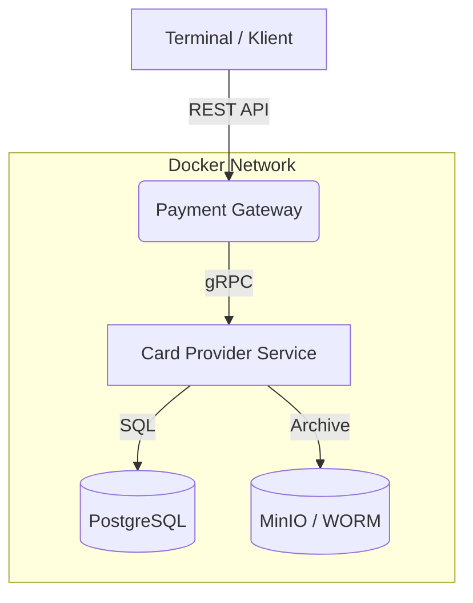
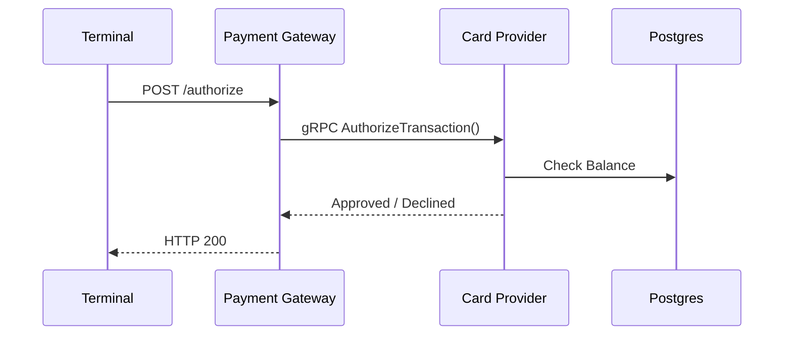
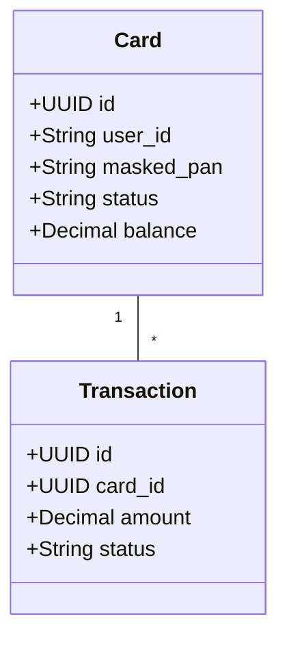

# 💳 Moduł: Karty Płatnicze (Payment Cards Domain)

> **Projekt Zaliczeniowy – Aplikacje Biznesowe**  
> Architektura Mikroserwisowa | Domain Driven Design | Python + gRPC + Docker

---

## 📋 Spis treści

1. Opis modułu
2. Architektura systemu
3. Wiedza Domenowa (Domain Knowledge)
4. Diagramy (Mermaid)
5. Struktura repozytorium
6. Technologie
7. Uruchomienie projektu
8. API – Kontrakty
9. Plan rozwoju (Roadmap)

---

## Opis modułu

Moduł **Karty Płatnicze** symuluje działanie procesora płatniczego (Acquirer/Issuer) w środowisku bankowym.

### Główne cele modułu

- Wydawanie kart wirtualnych i fizycznych (**Card Provider**)
- Autoryzacja transakcji w czasie rzeczywistym (gRPC)
- Obsługa terminala płatniczego (REST API)
- Rozliczenia (Settlement) i archiwizacja

---

## Architektura systemu



### Mikroserwisy

#### Card Provider Service (Issuer)

- Właściciel danych kart i kont
- Odpowiada za autoryzację
- Zarządza cyklem życia karty
- Python + gRPC Server

#### Payment Gateway Service (Acquirer)

- Punkt styku ze światem zewnętrznym
- Routing transakcji
- Obliczanie prowizji MSC
- Python + FastAPI + gRPC Client

---

## Wiedza Domenowa

### 1. Cykl życia płatności kartą

1. **Authorization** – sprawdzenie karty i blokada środków  
2. **Clearing** – wymiana informacji rozliczeniowych  
3. **Settlement** – finalny transfer środków

### 2. MSC (Merchant Service Charge)

- Interchange Fee
- Scheme Fee
- Acquirer Fee

### 3. Chargeback

Procedura reklamacji transakcji inicjowana przez posiadacza karty.

---

## Diagramy

### BPMN: Autoryzacja



### UML: Model danych



---

## Struktura repozytorium

```text
.
├── docker-compose.yaml
├── proto/
│   └── card.proto
├── card-provider-service/
├── payment-gateway-service/
└── README.md
```

---

## Technologie

| Warstwa | Technologia |
|---|---|
| Backend | Python 3.11+ |
| Komunikacja | gRPC |
| API | FastAPI |
| Baza danych | PostgreSQL |
| Archiwizacja | MinIO |
| Konteneryzacja | Docker Compose |

---

## Uruchomienie projektu

### Wymagania

- Docker Desktop / Podman
- Python 3.11+ (opcjonalnie)

### Start

```bash
docker-compose up --build
```

### Serwisy

- REST API: http://localhost:8000
- gRPC: localhost:50051
- PostgreSQL: localhost:5432

---

## API – Kontrakty

### REST

- `GET /`
- `POST /test-connection`
- `POST /api/v1/payments/authorize`

### gRPC

- `AuthorizeTransaction`
- `SettleTransaction`
- `CreateCard`

---

## Plan rozwoju

### Etap 1 (3.0)

- Struktura projektu i Docker
- SQLAlchemy models
- AuthorizeTransaction
- Emulacja terminala

### Etap 2 (4.0)

- Płatności offline
- Archiwizacja MinIO

### Etap 3 (5.0)

- Chargeback
- WORM Object Lock
- Szyfrowanie danych
