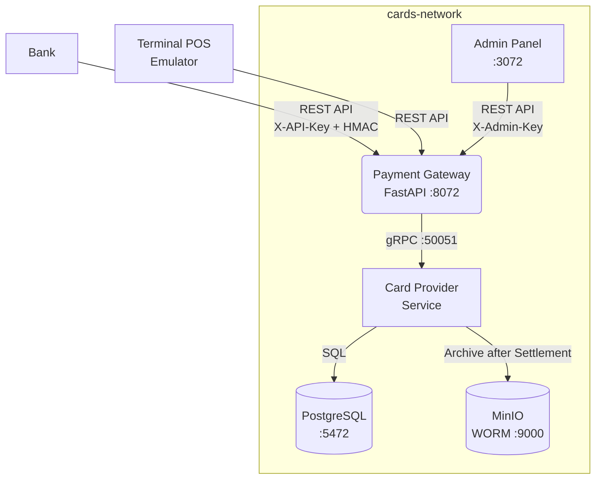
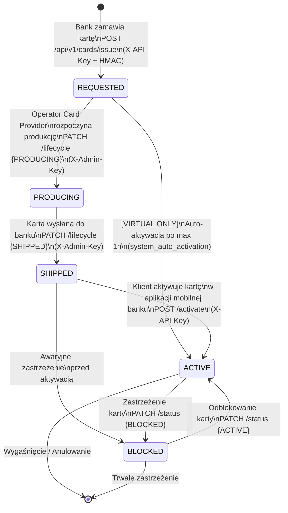
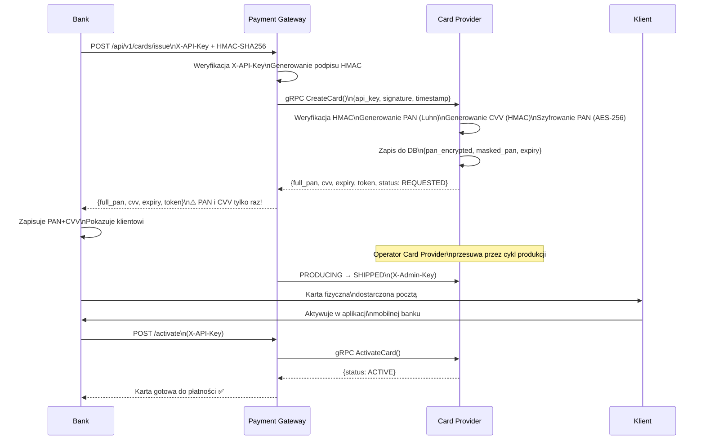
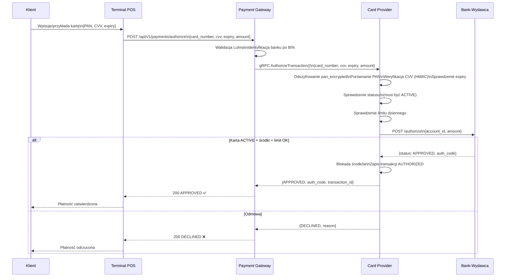
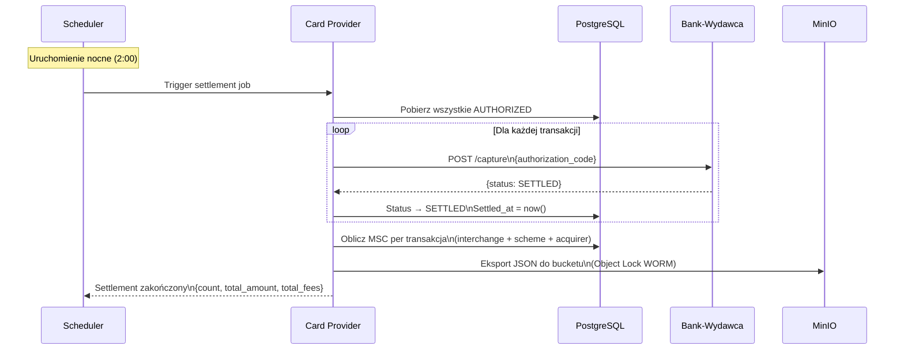
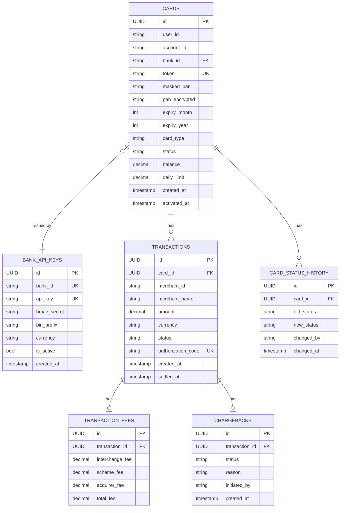

# 💳 Moduł: Karty Płatnicze (Payment Cards Domain)

> **Projekt Zaliczeniowy – Aplikacje Biznesowe**  
> Architektura Mikroserwisowa | Domain Driven Design | Python + gRPC + Docker

---

## 📋 Spis treści

1. [Opis modułu](#opis-modułu)
2. [Architektura systemu](#architektura-systemu)
3. [Wiedza Domenowa](#wiedza-domenowa)
4. [Bezpieczeństwo i kryptografia](#bezpieczeństwo-i-kryptografia)
5. [Cykl życia karty – Maszyna Stanów](#cykl-życia-karty--maszyna-stanów)
6. [Diagramy](#diagramy)
7. [Schemat bazy danych](#schemat-bazy-danych)
8. [Struktura repozytorium](#struktura-repozytorium)
9. [Technologie](#technologie)
10. [Uruchomienie projektu](#uruchomienie-projektu)
11. [Klucze API Banków – BIN Routing](#klucze-api-banków--bin-routing)
12. [API – Dokumentacja dla innych zespołów](#api--dokumentacja-dla-innych-zespołów)
13. [Integracja z modułem kart (dla zespołów bankowych)](#integracja-z-modułem-kart-dla-zespołów-bankowych)
14. [Plan rozwoju](#plan-rozwoju)

---

## Opis modułu

Moduł **Karty Płatnicze** symuluje działanie systemu typu **Visa/Mastercard** – czyli sieci kart płatniczych (Card Network) łączącej banki z terminalami płatniczymi. Składa się z **dwóch osobnych aplikacji**:

- **Card Provider Service** – wydawca kart (Card Network/Issuer Processor), generuje PAN, CVV, zarządza cyklem życia kart, autoryzuje transakcje
- **Payment Gateway Service** – procesor płatności (Acquirer Processor), obsługuje terminal POS, REST API dla banków i merchantów

### Główne funkcjonalności

- Generowanie 16-cyfrowego numeru karty (PAN) z algorytmem Luhna i prefiksem BIN
- Generowanie CVV kryptograficznie (HMAC-SHA256) bez przechowywania w bazie
- Szyfrowanie PAN w bazie danych (AES-256 przez Fernet)
- Wydawanie kart wirtualnych, fizycznych i prepaid
- Maszyna stanów karty: `REQUESTED → PRODUCING → SHIPPED → ACTIVE → BLOCKED`
- Autoryzacja transakcji w czasie rzeczywistym (gRPC)
- Clearing i Settlement w cyklu dobowym
- MSC (Merchant Service Charge) z podziałem prowizji
- Archiwizacja transakcji w MinIO (WORM)
- Emulacja terminala płatniczego (POS)
- Panel administratora (React)

---

## Architektura systemu


```mermaid
graph TD
    BANK[Bank] -->|REST API\nX-API-Key + HMAC| GW(Payment Gateway\nFastAPI :8072)
    TERMINAL[Terminal POS\nEmulator] -->|REST API| GW
    ADMIN[Admin Panel\n:3072] -->|REST API\nX-Admin-Key| GW
    GW -->|gRPC :50051| CP[Card Provider\nService]
    CP -->|SQL| DB[(PostgreSQL\n:5472)]
    CP -->|Archive after Settlement| MINIO[(MinIO\nWORM :9000)]

    subgraph cards-network
        GW
        CP
        DB
        MINIO
        ADMIN
    end
```

### Mikroserwisy

#### Card Provider Service (port 50091 zewnętrzny / 50051 wewnętrzny – gRPC)
- Generowanie i szyfrowanie PAN
- Generowanie CVV kryptograficznie
- Autoryzacja transakcji
- Maszyna stanów karty
- Clearing i Settlement

#### Payment Gateway Service (port 8072 – REST)
- Punkt styku ze światem zewnętrznym
- Weryfikacja kluczy API banków (X-API-Key)
- Generowanie i weryfikacja podpisów HMAC-SHA256
- Routing do Card Provider przez gRPC
- Obliczanie prowizji MSC
- Swagger UI: `http://localhost:8072/docs`

#### Admin Panel (port 3072 – React)
- Logowanie administratora
- Dashboard ze statystykami kart
- Zarządzanie cyklem życia kart
- Podgląd pełnych danych karty (tryb DEV)

---

## Wiedza Domenowa

### My jako Visa/Mastercard

W tym projekcie **jesteśmy siecią kart płatniczych** (Card Network) – pełnimy rolę analogiczną do Visa lub Mastercard:

```
MY (Card Network)           BANKI                   MERCHANT/TERMINAL
─────────────────           ─────                   ────────────────
Generujemy PAN + CVV   →   Bank otrzymuje PAN+CVV
                            Bank pokazuje klientowi
                                                 ←  Klient płaci kartą
Autoryzujemy           ←   Terminal wysyła PAN
Pytamy bank o saldo    →
Odpowiadamy APPROVED   →                        →   Transakcja zatwierdzona
```

### Model 4-stronny (Four-Party Scheme)

```
Klient → [Merchant/Terminal] → [Acquirer = My] → [Issuer = Bank] → Klient
```

### Struktura numeru karty (PAN)

```
4 1 0 0 0 1 | X X X X X X X X X | L
─────────── ─────────────────── ─
BIN (6 cyfr)  środkowe (9 cyfr)   cyfra Luhna
identyfikuje  losowe, unikalne    weryfikacja
bank-wydawcę                      poprawności
```

### Etapy płatności kartą

| Etap | Opis | Czas |
|---|---|---|
| **Authorization** | Sprawdzenie karty, blokada środków | Real-time (ms) |
| **Capture** | Potwierdzenie transakcji przez merchanta | Chwilę po auth |
| **Clearing** | Wymiana informacji rozliczeniowych | T+0 do T+1 |
| **Settlement** | Finalny transfer środków między bankami | T+1 |

### Komunikacja – ISO 8583 i gRPC

Fizyczne terminale POS używają protokołu **ISO 8583** – binarnego protokołu telekomunikacyjnego z 128+ polami danych (Data Elements) i nagłówkiem MTI (Message Type Indicator).

W projekcie implementujemy **uproszczony podzbiór ISO 8583** – wiadomości zawierają rzeczywiste pola DE (MTI, DE2, DE3, DE4, DE7, DE11, DE41, DE49) w czytelnym formacie, bez wymagań licencyjnych pełnej implementacji.

Komunikacja wewnętrzna między serwisami pozostaje w **gRPC + Protocol Buffers**. Warstwa wejściowa (terminal → Payment Gateway) przyjmuje strukturę ISO 8583.

> ⚠️ **Szczegółowy format wiadomości ISO 8583 jest w trakcie ustalania z prowadzącym.**

### MSC (Merchant Service Charge)

Prowizja pobierana od każdej transakcji, dzielona na 3 składowe:

| Składowa | Odbiorca | Stawka |
|---|---|---|
| Interchange Fee | Bank wydawcy karty | ~1.5% |
| Scheme Fee | Card Provider (my) | ~0.3% |
| Acquirer Fee | Payment Gateway | ~0.2% |

---

## Bezpieczeństwo i kryptografia

### Generowanie PAN

Pełny 16-cyfrowy PAN generowany jest przez Card Provider (nas) przy każdym zamówieniu karty:

```
BIN(6) + środkowe_losowe(9) + cyfra_Luhna(1) = 16 cyfr
```

Algorytm Luhna zapewnia poprawność numeru i chroni przed przypadkowymi błędami przy wpisywaniu.

### Generowanie CVV

CVV generowany jest kryptograficznie za pomocą HMAC-SHA256 z tajnym kluczem CVK (Card Verification Key):

```
CVV = HMAC-SHA256(PAN + Expiry + ServiceCode, CVK)[:3]
```

**CVV nie jest przechowywany w bazie** – przy weryfikacji jest obliczany ponownie i porównywany. Nawet jeśli baza danych zostanie skompromitowana, atakujący nie uzyska CVV.

### Szyfrowanie PAN (AES-256)

Pełny PAN przechowywany jest w bazie w formie zaszyfrowanej (Fernet AES-256):

```
W bazie:      pan_encrypted = Fernet.encrypt(full_pan, PAN_ENCRYPTION_KEY)
Przy autoryzacji: full_pan = Fernet.decrypt(pan_encrypted, PAN_ENCRYPTION_KEY)
Widoczne:     masked_pan = "4100 01** **** 1234"
```

### Jednorazowe przekazanie danych do banku

Przy wydaniu karty, pełny PAN i CVV są zwracane bankowi **jednorazowo** w odpowiedzi API:

```json
{
  "full_pan": "4100011234567890",
  "cvv": "123",
  "expiry_month": 5,
  "expiry_year": 29,
  "message": "IMPORTANT: Save full_pan and cvv - they will never be shown again."
}
```

Bank zapisuje te dane u siebie i pokazuje klientowi. My po tym nigdy już nie zwrócimy pełnego PAN (poza trybem DEV dla administratora).

### Uwierzytelnianie banków – HMAC + API Key

Każde żądanie od banku musi zawierać:

```
Nagłówek:  X-API-Key: bank-key-pl-a
Podpis:    HMAC-SHA256(timestamp + body, hmac_secret)
Timestamp: Unix timestamp (żądanie ważne max 30 sekund)
```

Chroni to przed:
- Nieautoryzowanym dostępem (X-API-Key)
- Fałszowaniem requestów (HMAC podpis)
- Atakami replay (timestamp + 30s okno)

### Dwa poziomy dostępu

| Klucz | Kto | Do czego |
|---|---|---|
| `X-API-Key` | Banki | Wydawanie kart, blokowanie, aktywacja |
| `X-Admin-Key` | Operator Card Provider (my) | Lista kart, cykl produkcji, podgląd PAN (DEV) |

---

## Cykl życia karty – Maszyna Stanów

### Diagram stanów


```mermaid
stateDiagram-v2
    [*] --> REQUESTED : Bank zamawia kartę\nPOST /api/v1/cards/issue\n(X-API-Key + HMAC)

    REQUESTED --> PRODUCING : Operator Card Provider\nrozpoczyna produkcję\nPATCH /lifecycle {PRODUCING}\n(X-Admin-Key)

    REQUESTED --> ACTIVE : [VIRTUAL ONLY]\nAuto-aktywacja po max 1h\n(system_auto_activation)

    PRODUCING --> SHIPPED : Karta wysłana do banku\nPATCH /lifecycle {SHIPPED}\n(X-Admin-Key)

    SHIPPED --> ACTIVE : Klient aktywuje kartę\nw aplikacji mobilnej banku\nPOST /activate\n(X-API-Key)

    SHIPPED --> BLOCKED : Awaryjne zastrzeżenie\nprzed aktywacją

    ACTIVE --> BLOCKED : Zastrzeżenie karty\nPATCH /status {BLOCKED}
    BLOCKED --> ACTIVE : Odblokowanie karty\nPATCH /status {ACTIVE}

    ACTIVE --> [*] : Wygaśnięcie / Anulowanie
    BLOCKED --> [*] : Trwałe zastrzeżenie
```

### Logika per typ karty

| Typ | Status startowy | Aktywacja | Saldo | PAN/CVV |
|---|---|---|---|---|
| **VIRTUAL** | REQUESTED | Auto po max 1h | Brak | Generowane przez nas |
| **PHYSICAL** | REQUESTED | Ręczna przez klienta (po SHIPPED) | Brak | Generowane przez nas |
| **PREPAID** | REQUESTED | Ręczna przez klienta (po SHIPPED) | Własne saldo | Generowane przez nas |

### Dozwolone przejścia stanów

```
REQUESTED  → PRODUCING          (operator Card Provider, X-Admin-Key)
PRODUCING  → SHIPPED            (operator Card Provider, X-Admin-Key)
SHIPPED    → ACTIVE             (klient aktywuje w aplikacji banku, X-API-Key)
SHIPPED    → BLOCKED            (awaryjne zastrzeżenie)
ACTIVE     → BLOCKED            (zastrzeżenie – bank lub admin)
BLOCKED    → ACTIVE             (odblokowanie – bank lub admin)
```

---

## Diagramy

### BPMN: Wydanie karty fizycznej z pełnym przepływem PAN/CVV


```mermaid
sequenceDiagram
    participant B as Bank
    participant GW as Payment Gateway
    participant CP as Card Provider
    participant K as Klient

    B->>GW: POST /api/v1/cards/issue\nX-API-Key + HMAC-SHA256
    GW->>GW: Weryfikacja X-API-Key\nGenerowanie podpisu HMAC
    GW->>CP: gRPC CreateCard()\n{api_key, signature, timestamp}
    CP->>CP: Weryfikacja HMAC\nGenerowanie PAN (Luhn)\nGenerowanie CVV (HMAC)\nSzyfrowanie PAN (AES-256)
    CP->>CP: Zapis do DB\n{pan_encrypted, masked_pan, expiry}
    CP-->>GW: {full_pan, cvv, expiry, token, status: REQUESTED}
    GW-->>B: {full_pan, cvv, expiry, token}\n⚠️ PAN i CVV tylko raz!

    B->>B: Zapisuje PAN+CVV\nPokazuje klientowi

    Note over CP: Operator Card Provider\nprzesuwa przez cykl produkcji
    GW->>CP: PRODUCING → SHIPPED\n(X-Admin-Key)

    B->>K: Karta fizyczna\ndostarczona pocztą
    K->>B: Aktywuje w aplikacji\nmobilnej banku
    B->>GW: POST /activate\n(X-API-Key)
    GW->>CP: gRPC ActivateCard()
    CP-->>GW: {status: ACTIVE}
    GW-->>B: Karta gotowa do płatności ✅
```

### BPMN: Autoryzacja płatności kartą


```mermaid
sequenceDiagram
    participant K as Klient
    participant T as Terminal POS
    participant GW as Payment Gateway
    participant CP as Card Provider
    participant BANK as Bank-Wydawca

    K->>T: Wpisuje/przykłada kartę\n{PAN, CVV, expiry}
    T->>GW: POST /api/v1/payments/authorize\n{card_number, cvv, expiry, amount}
    GW->>GW: Walidacja Luhna\nIdentyfikacja banku po BIN
    GW->>CP: gRPC AuthorizeTransaction()\n{card_number, cvv, expiry, amount}
    CP->>CP: Odszyfrowanie pan_encrypted\nPorównanie PAN\nWeryfikacja CVV (HMAC)\nSprawdzenie expiry
    CP->>CP: Sprawdzenie statusu\n(musi być ACTIVE)
    CP->>CP: Sprawdzenie limitu dziennego
    CP->>BANK: POST /authorize\n{account_id, amount}
    alt Karta ACTIVE + środki + limit OK
        BANK-->>CP: {status: APPROVED, auth_code}
        CP->>CP: Blokada środków\nZapis transakcji AUTHORIZED
        CP-->>GW: {APPROVED, auth_code, transaction_id}
        GW-->>T: 200 APPROVED ✅
        T-->>K: Płatność zatwierdzona
    else Odmowa
        CP-->>GW: {DECLINED, reason}
        GW-->>T: 200 DECLINED ❌
        T-->>K: Płatność odrzucona
    end
```

### BPMN: Clearing & Settlement (nocny)


```mermaid
sequenceDiagram
    participant S as Scheduler
    participant CP as Card Provider
    participant DB as PostgreSQL
    participant BANK as Bank-Wydawca
    participant MINIO as MinIO

    Note over S: Uruchomienie nocne (2:00)
    S->>CP: Trigger settlement job
    CP->>DB: Pobierz wszystkie AUTHORIZED
    loop Dla każdej transakcji
        CP->>BANK: POST /capture\n{authorization_code}
        BANK-->>CP: {status: SETTLED}
        CP->>DB: Status → SETTLED\nSettled_at = now()
    end
    CP->>DB: Oblicz MSC per transakcja\n(interchange + scheme + acquirer)
    CP->>MINIO: Eksport JSON do bucketu\n(Object Lock WORM)
    CP-->>S: Settlement zakończony\n{count, total_amount, total_fees}
```

---

## Schemat bazy danych


```mermaid
erDiagram
    CARDS {
        UUID id PK
        string user_id
        string account_id
        string bank_id FK
        string token UK
        string masked_pan
        string pan_encrypted
        int expiry_month
        int expiry_year
        string card_type
        string status
        decimal balance
        decimal daily_limit
        timestamp created_at
        timestamp activated_at
    }

    BANK_API_KEYS {
        UUID id PK
        string bank_id UK
        string api_key UK
        string hmac_secret
        string bin_prefix
        string currency
        bool is_active
        timestamp created_at
    }

    TRANSACTIONS {
        UUID id PK
        UUID card_id FK
        string merchant_id
        string merchant_name
        decimal amount
        string currency
        string status
        string authorization_code UK
        timestamp created_at
        timestamp settled_at
    }

    TRANSACTION_FEES {
        UUID id PK
        UUID transaction_id FK
        decimal interchange_fee
        decimal scheme_fee
        decimal acquirer_fee
        decimal total_fee
    }

    CARD_STATUS_HISTORY {
        UUID id PK
        UUID card_id FK
        string old_status
        string new_status
        string changed_by
        timestamp changed_at
    }

    CHARGEBACKS {
        UUID id PK
        UUID transaction_id FK
        string status
        string reason
        string initiated_by
        timestamp created_at
    }

    CARDS ||--o{ TRANSACTIONS : "has"
    CARDS ||--o{ CARD_STATUS_HISTORY : "has"
    CARDS }o--|| BANK_API_KEYS : "issued by"
    TRANSACTIONS ||--o| TRANSACTION_FEES : "has"
    TRANSACTIONS ||--o| CHARGEBACKS : "has"
```

---

## Struktura repozytorium

```
.
├── docker-compose.yaml
├── proto/
│   └── card.proto                    # Kontrakt gRPC
├── card-provider-service/
│   ├── Dockerfile
│   ├── requirements.txt
│   ├── alembic/                      # Migracje bazy danych
│   └── app/
│       ├── main.py                   # Serwer gRPC + logika biznesowa
│       ├── models.py                 # SQLAlchemy modele
│       ├── database.py               # Połączenie DB + seed kluczy API
│       ├── card_pb2.py               # Wygenerowane z proto
│       └── card_pb2_grpc.py
├── payment-gateway-service/
│   ├── Dockerfile
│   ├── requirements.txt
│   └── app/
│       ├── main.py                   # FastAPI REST API
│       ├── card_pb2.py
│       └── card_pb2_grpc.py
├── admin-panel/
│   ├── Dockerfile
│   ├── nginx.conf
│   ├── package.json
│   └── src/
│       ├── App.jsx
│       ├── api.js
│       └── components/
│           ├── Login.jsx
│           ├── Dashboard.jsx
│           ├── CardList.jsx
│           └── CardDetail.jsx
├── test_hmac.py                      # Testy bezpieczeństwa HMAC
└── README.md
```

---

## Technologie

| Warstwa | Technologia | Uzasadnienie |
|---|---|---|
| Backend | Python 3.11 | Szybki development, bogate biblioteki |
| Komunikacja wewnętrzna | gRPC + Protocol Buffers | Binarny, typowany kontrakt – analogia do ISO 8583 |
| REST API | FastAPI | Automatyczny Swagger, async, Pydantic |
| Baza danych | PostgreSQL 16 | ACID – krytyczne przy transakcjach finansowych |
| Szyfrowanie PAN | Fernet (AES-256) | Standard szyfrowania symetrycznego |
| Podpis requestów | HMAC-SHA256 | Weryfikacja autentyczności żądań banków |
| CVV | HMAC-SHA256 + CVK | Kryptograficzne generowanie bez przechowywania |
| Frontend | React + Vite + Nginx | Panel admina |
| Archiwizacja | MinIO | S3-compatible, Object Lock (WORM) |
| Konteneryzacja | Docker Compose | Izolacja, łatwe uruchomienie |

---

## Uruchomienie projektu

### Wymagania

- Docker Desktop lub Podman

### Start

```bash
docker-compose up --build
```

### Serwisy po uruchomieniu

| Serwis | Adres | Opis |
|---|---|---|
| REST API + Swagger | http://localhost:8072/docs | Główny interfejs |
| Payment Gateway | http://localhost:8072 | REST API |
| Card Provider | localhost:50091 | gRPC (wewnętrzny) |
| PostgreSQL | localhost:5472 | Baza danych |
| Admin Panel | http://localhost:3072 | Panel admina (admin/admin123) |
| MinIO Console | http://localhost:9001 | Archiwum (planowane) |

### Zmienne środowiskowe

| Zmienna | Domyślna | Opis |
|---|---|---|
| `DATABASE_URL` | `postgresql+asyncpg://...` | Połączenie z PostgreSQL |
| `GRPC_SERVER_URL` | `card-provider:50051` | Adres Card Provider |
| `VIRTUAL_CARD_ACTIVATION_DELAY` | `3600` | Auto-aktywacja Virtual w sekundach |
| `PAN_ENCRYPTION_KEY` | `karty-platnicze-key-2026` | Klucz szyfrowania AES-256 |
| `CARD_VERIFICATION_KEY` | `cvk-secret-key-2026` | Klucz generowania CVV |
| `ADMIN_API_KEY` | `admin-secret-key-2026` | Klucz X-Admin-Key |

> **DEV TIP:** `VIRTUAL_CARD_ACTIVATION_DELAY=60` w docker-compose.yaml – karta wirtualna aktywuje się po 60 sekundach zamiast 1 godziny.

---

## Klucze API Banków – BIN Routing

Każdy bank otrzymuje unikalny klucz API i sekret HMAC przy podpisaniu umowy z procesorem kart. Na podstawie klucza przypisywany jest **6-cyfrowy prefiks BIN**, który identyfikuje bank-wydawcę podczas autoryzacji.

| bank_id | Klucz API | Sekret HMAC | Prefiks BIN | Waluta |
|---|---|---|---|---|
| `POLISH_BANK_A` | `bank-key-pl-a` | `secret-pl-a-hmac` | `410001` | PLN |
| `POLISH_BANK_B` | `bank-key-pl-b` | `secret-pl-b-hmac` | `420001` | PLN |
| `EURO_BANK_A` | `bank-key-eu-a` | `secret-eu-a-hmac` | `430001` | EUR |
| `EURO_BANK_B` | `bank-key-eu-b` | `secret-eu-b-hmac` | `440001` | EUR |
| `UK_BANK_A` | `bank-key-uk-a` | `secret-uk-a-hmac` | `450001` | GBP |
| `UK_BANK_B` | `bank-key-uk-b` | `secret-uk-b-hmac` | `460001` | GBP |
| `US_BANK_A` | `bank-key-us-a` | `secret-us-a-hmac` | `470001` | USD |
| `US_BANK_B` | `bank-key-us-b` | `secret-us-b-hmac` | `480001` | USD |

---

## API – Dokumentacja dla innych zespołów

> Pełna dokumentacja interaktywna: **http://localhost:8072/docs**

### Endpointy REST (Payment Gateway :8072)

#### Karty

| Metoda | Endpoint | Auth | Opis |
|---|---|---|---|
| `POST` | `/api/v1/cards/issue` | X-API-Key | Wydaj nową kartę |
| `GET` | `/api/v1/cards` | X-Admin-Key | Lista wszystkich kart |
| `GET` | `/api/v1/cards/{token}` | — | Szczegóły karty |
| `GET` | `/api/v1/cards/{token}/full-pan` | X-Admin-Key | Pełny PAN (tylko DEV) |
| `PATCH` | `/api/v1/cards/{token}/status` | X-API-Key lub X-Admin-Key | Zablokuj / Odblokuj |
| `PATCH` | `/api/v1/cards/{token}/lifecycle` | X-Admin-Key | Przesuń przez cykl produkcji |
| `POST` | `/api/v1/cards/{token}/activate` | X-API-Key | Aktywuj kartę |
| `POST` | `/api/v1/cards/{token}/topup` | — | Doładuj kartę prepaid |

#### Płatności

| Metoda | Endpoint | Auth | Opis |
|---|---|---|---|
| `POST` | `/api/v1/payments/authorize` | — | Autoryzuj płatność |
| `POST` | `/api/v1/payments/{id}/capture` | — | Potwierdź transakcję |
| `POST` | `/api/v1/payments/{id}/refund` | — | Zwrot środków |

### gRPC (Card Provider – port 50091)

Plik kontraktu: `proto/card.proto`

```protobuf
service CardProvider {
    rpc CreateCard (CreateCardRequest) returns (CreateCardResponse);
    rpc GetCardStatus (GetCardRequest) returns (CardDetails);
    rpc GetFullPan (GetCardRequest) returns (FullPanResponse);
    rpc ListCards (ListCardsRequest) returns (ListCardsResponse);
    rpc BlockCard (BlockCardRequest) returns (BlockCardResponse);
    rpc UnblockCard (UnblockCardRequest) returns (UnblockCardResponse);
    rpc UpdateCardStatus (UpdateCardStatusRequest) returns (UpdateCardStatusResponse);
    rpc ActivateCard (ActivateCardRequest) returns (ActivateCardResponse);
    rpc TopUpPrepaid (TopUpRequest) returns (TopUpResponse);
    rpc AuthorizeTransaction (AuthorizationRequest) returns (AuthorizationResponse);
    rpc SettleTransaction (SettlementRequest) returns (SettlementResponse);
    rpc InitiateChargeback (ChargebackRequest) returns (ChargebackResponse);
}
```

---

## Integracja z modułem kart (dla zespołów bankowych)

> **Ta sekcja jest przeznaczona dla zespołów tworzących moduły bankowe.**  
> URL: `http://localhost:8072`

### 1. Jak podpisać żądanie (HMAC)

Każde żądanie wydania karty musi być podpisane. Przykład w Pythonie:

```python
import hmac, hashlib, time, json

API_KEY = "bank-key-pl-a"
HMAC_SECRET = "secret-pl-a-hmac"

def sign_request(body: dict) -> tuple[str, str]:
    timestamp = str(int(time.time()))
    body_json = json.dumps(body, separators=(',', ':'), sort_keys=True)
    payload = timestamp + body_json
    signature = hmac.new(
        HMAC_SECRET.encode(), payload.encode(), hashlib.sha256
    ).hexdigest()
    return signature, timestamp
```

### 2. Jak zamówić kartę

```bash
curl -X POST http://localhost:8072/api/v1/cards/issue \
  -H "Content-Type: application/json" \
  -H "X-API-Key: bank-key-pl-a" \
  -d '{
    "user_id": "twoj_user_id",
    "account_id": "twoje_account_id",
    "card_type": "VIRTUAL",
    "initial_balance": 0
  }'
```

**Odpowiedź (jednorazowa – zapisz pełne dane):**
```json
{
  "card_token": "tok_abc123...",
  "masked_pan": "4100 01** **** 7890",
  "full_pan": "4100011234567890",
  "cvv": "123",
  "expiry_month": 5,
  "expiry_year": 29,
  "status": "REQUESTED",
  "card_type": "VIRTUAL",
  "bank_id": "POLISH_BANK_A",
  "message": "IMPORTANT: Save full_pan and cvv - they will never be shown again."
}
```

> ⚠️ `full_pan` i `cvv` są zwracane **tylko raz**. Bank musi je zapisać i pokazać klientowi.

### 3. Typy kart

| Typ | Opis | Aktywacja |
|---|---|---|
| `VIRTUAL` | Bez fizycznego nośnika | Auto po max 1h |
| `PHYSICAL` | Karta plastikowa | Klient aktywuje po otrzymaniu |
| `PREPAID` | Z własnym saldem | Klient aktywuje po otrzymaniu |

### 4. Jak aktywować kartę fizyczną/prepaid

```bash
curl -X POST http://localhost:8072/api/v1/cards/{card_token}/activate \
  -H "Content-Type: application/json" \
  -H "X-API-Key: bank-key-pl-a" \
  -d '{"activated_by": "customer_id"}'
```

### 5. Jak zablokować/odblokować kartę

```bash
curl -X PATCH http://localhost:8072/api/v1/cards/{card_token}/status \
  -H "Content-Type: application/json" \
  -H "X-API-Key: bank-key-pl-a" \
  -d '{"status": "BLOCKED", "reason": "Lost card"}'
```

### 6. Co bank musi zaimplementować po swojej stronie

#### `POST /api/v1/authorize`

```json
// Request od nas:
{
  "account_id": "uuid",
  "amount": 150.00,
  "currency": "PLN",
  "transaction_id": "uuid",
  "merchant_name": "Sklep XYZ"
}

// Response oczekiwany:
{
  "authorization_code": "AUTH-789XYZ",
  "status": "APPROVED",
  "decline_reason": null
}
```

Możliwe `decline_reason`: `INSUFFICIENT_FUNDS`, `ACCOUNT_BLOCKED`, `LIMIT_EXCEEDED`

#### `POST /api/v1/capture`

```json
// Request od nas:
{ "authorization_code": "AUTH-789XYZ", "transaction_id": "uuid" }

// Response:
{ "status": "SETTLED" }
```

#### `POST /api/v1/refund`

```json
// Request od nas:
{ "account_id": "uuid", "amount": 150.00, "currency": "PLN", "original_transaction_id": "uuid" }

// Response:
{ "status": "REFUNDED" }
```

### 7. Kody odpowiedzi autoryzacji

| Kod | Znaczenie |
|---|---|
| `APPROVED` | Transakcja zatwierdzona |
| `DECLINED` | Odmowa ogólna |
| `CARD_BLOCKED` | Karta zastrzeżona |
| `CARD_NOT_ACTIVE` | Karta nie przeszła aktywacji |
| `INSUFFICIENT_FUNDS` | Brak środków |
| `LIMIT_EXCEEDED` | Przekroczony limit dzienny |
| `INVALID_CVV` | Nieprawidłowy kod CVV |
| `CARD_EXPIRED` | Karta wygasła |
| `BANK_TIMEOUT` | Bank nie odpowiedział w czasie |

---

## Plan rozwoju

### Etap 1 – Ocena 3.0

| Zadanie | Kto | Status |
|---|---|---|
| Baza danych + modele SQLAlchemy | Filip | ✅ Zrobione |
| Generowanie PAN (Luhn, BIN 6 cyfr) | Filip | ✅ Zrobione |
| Generowanie CVV (HMAC-SHA256) | Filip | ✅ Zrobione |
| Szyfrowanie PAN (AES-256 Fernet) | Filip | ✅ Zrobione |
| gRPC CreateCard + typy kart | Filip | ✅ Zrobione |
| Maszyna stanów karty | Filip | ✅ Zrobione |
| Auto-aktywacja karty wirtualnej | Filip | ✅ Zrobione |
| REST API dla kart | Filip | ✅ Zrobione |
| BIN routing + API Keys banków | Filip | ✅ Zrobione |
| HMAC-SHA256 auth + replay protection | Filip | ✅ Zrobione |
| Doładowanie karty prepaid | Filip | ✅ Zrobione |
| Panel admina (React) | Filip | ✅ Zrobione |
| AuthorizeTransaction (gRPC) | Kolega | 🔄 W trakcie |
| REST API Terminal POS | Kolega | 🔄 W trakcie |
| MSC – Merchant Service Charge | Kolega | 🔄 W trakcie |
| Clearing & Settlement (nocny job) | Kolega | 🔄 W trakcie |
| Panel terminala (POS UI) | Kolega | 🔄 W trakcie |

### Etap 2 – Ocena 4.0

| Zadanie | Kto | Status |
|---|---|---|
| Archiwizacja MinIO (WORM) | Filip | ⏳ Planowane |
| Płatności offline (floor limit) | Kolega | ⏳ Planowane |

### Etap 3 – Ocena 5.0

| Zadanie | Kto | Status |
|---|---|---|
| Mechanizm Chargeback | Kolega | ⏳ Planowane |
| Symulacja sieci VPN / izolacja Docker | Filip | ⏳ Planowane |
