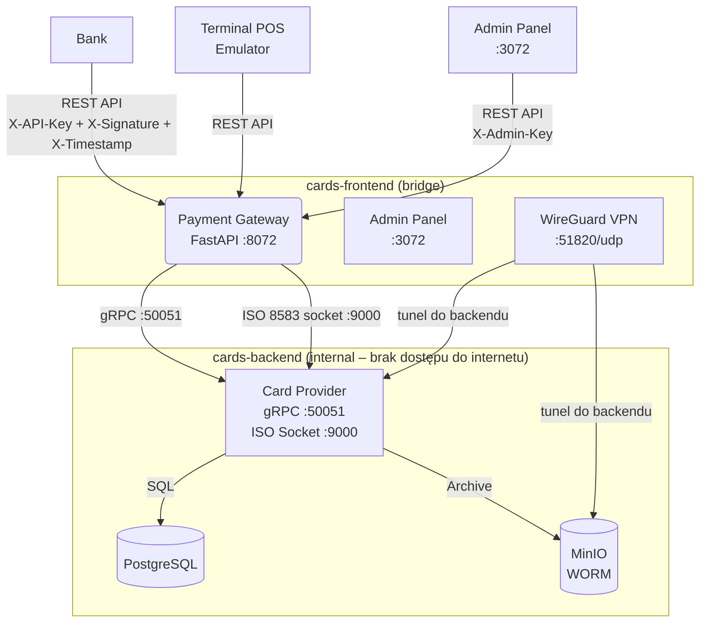
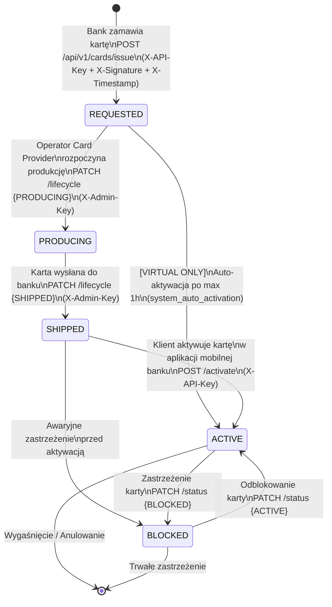
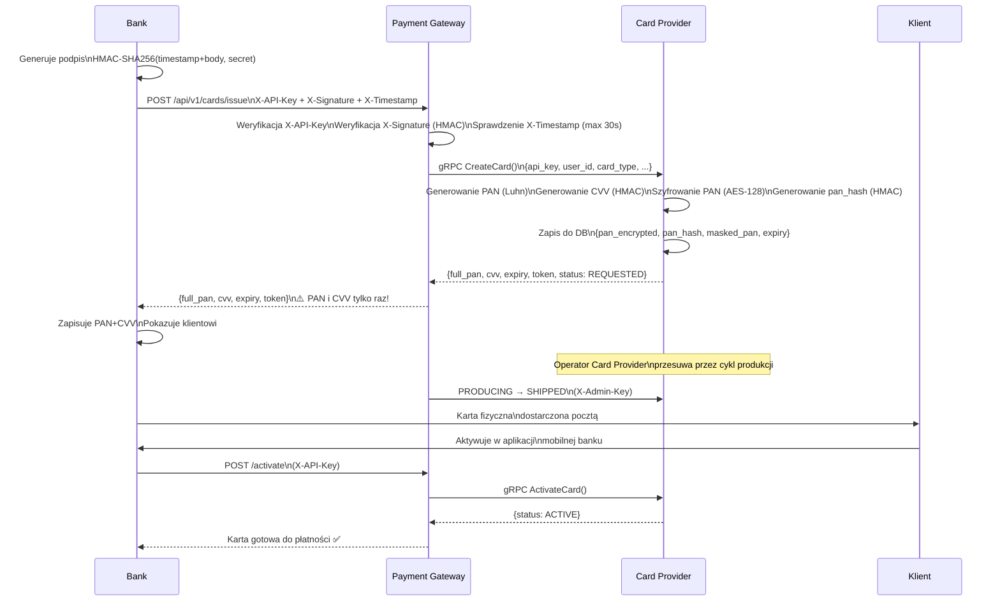
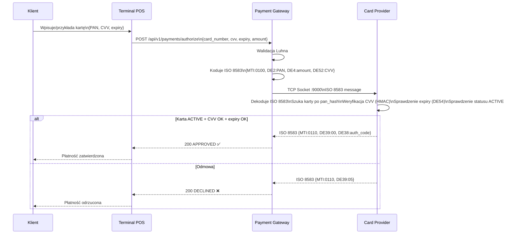
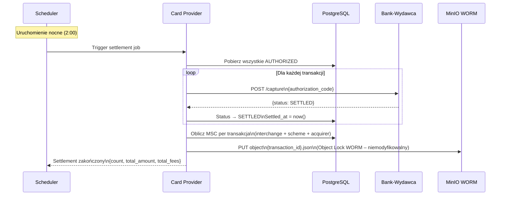
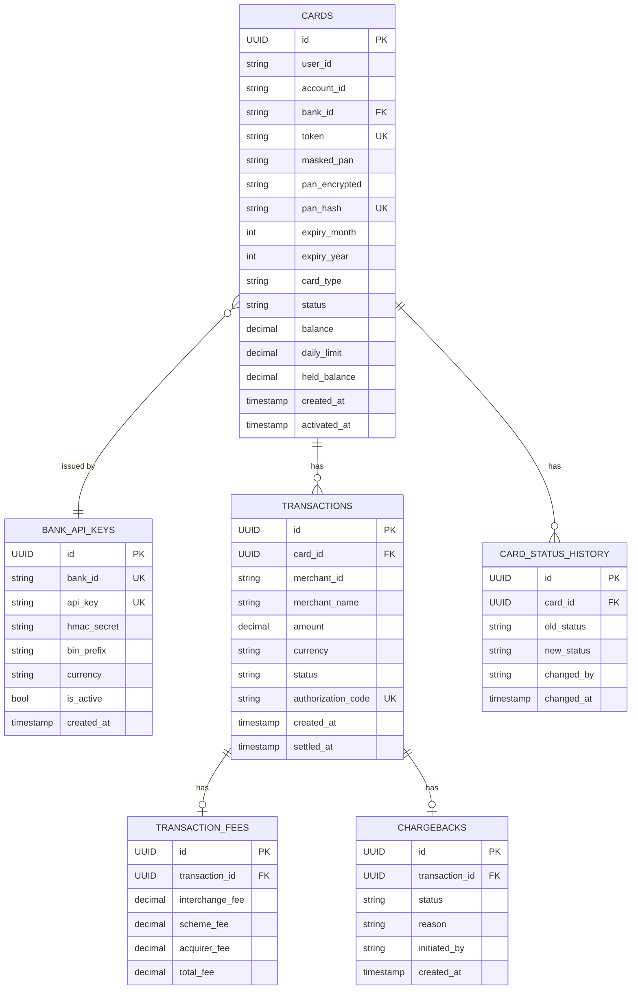

# 💳 Moduł: Karty Płatnicze (Payment Cards Domain)

> **Projekt Zaliczeniowy – Aplikacje Biznesowe**  
> Architektura Mikroserwisowa | Domain Driven Design | Python + gRPC + Docker

---

## 📋 Spis treści

1. [Opis modułu](#opis-modułu)
2. [Architektura systemu](#architektura-systemu)
3. [Bezpieczeństwo sieci – izolacja i VPN](#bezpieczeństwo-sieci--izolacja-i-vpn)
4. [Wiedza Domenowa](#wiedza-domenowa)
5. [Bezpieczeństwo i kryptografia](#bezpieczeństwo-i-kryptografia)
6. [Cykl życia karty – Maszyna Stanów](#cykl-życia-karty--maszyna-stanów)
7. [Diagramy](#diagramy)
8. [Schemat bazy danych](#schemat-bazy-danych)
9. [Struktura repozytorium](#struktura-repozytorium)
10. [Technologie](#technologie)
11. [Uruchomienie projektu](#uruchomienie-projektu)
12. [Klucze API Banków – BIN Routing](#klucze-api-banków--bin-routing)
13. [API – Dokumentacja dla innych zespołów](#api--dokumentacja-dla-innych-zespołów)
14. [Integracja z modułem kart (dla zespołów bankowych)](#integracja-z-modułem-kart-dla-zespołów-bankowych)
15. [Plan rozwoju](#plan-rozwoju)

---

## Opis modułu

Moduł **Karty Płatnicze** symuluje działanie systemu typu **Visa/Mastercard** – czyli sieci kart płatniczych (Card Network) łączącej banki z terminalami płatniczymi. Składa się z **dwóch osobnych aplikacji**:

- **Card Provider Service** – wydawca kart (Card Network/Issuer Processor), generuje PAN, CVV, zarządza cyklem życia kart, autoryzuje transakcje przez protokół ISO 8583
- **Payment Gateway Service** – procesor płatności (Acquirer Processor), obsługuje terminal POS, REST API dla banków i merchantów

### Główne funkcjonalności

- Generowanie 16-cyfrowego numeru karty (PAN) z algorytmem Luhna i prefiksem BIN
- Generowanie CVV kryptograficznie (HMAC-SHA256) bez przechowywania w bazie
- Deterministyczny hash PAN do wykrywania kolizji i wyszukiwania (`pan_hash`)
- Szyfrowanie PAN w bazie danych (AES-128 przez Fernet)
- Wydawanie kart wirtualnych, fizycznych i prepaid
- Maszyna stanów karty: `REQUESTED → PRODUCING → SHIPPED → ACTIVE → BLOCKED`
- Autoryzacja transakcji przez protokół ISO 8583 (socket TCP)
- Authorization hold (blokada środków przed settlementem)
- Clearing i Settlement w konfigurowalnym cyklu batchowym (domyślnie dobowym)
- MSC (Merchant Service Charge) z podziałem prowizji
- Archiwizacja transakcji w MinIO (WORM / Object Lock)
- Emulacja terminala płatniczego (POS)
- Panel administratora (React)
- Segmentacja sieci Docker z bramą WireGuard VPN

---

## Architektura systemu


```mermaid
graph TD
    BANK[Bank] -->|REST API\nX-API-Key + X-Signature + X-Timestamp| GW
    TERMINAL[Terminal POS\nEmulator] -->|REST API| GW
    ADMIN[Admin Panel\n:3072] -->|REST API\nX-Admin-Key| GW

    subgraph cards-frontend ["cards-frontend (bridge)"]
        GW(Payment Gateway\nFastAPI :8072)
        PANEL[Admin Panel\n:3072]
        VPN[WireGuard VPN\n:51820/udp]
    end

    subgraph cards-backend ["cards-backend (internal – brak dostępu do internetu)"]
        CP[Card Provider\ngRPC :50051\nISO Socket :9000]
        DB[(PostgreSQL)]
        MINIO[(MinIO\nWORM)]
    end

    GW -->|gRPC :50051| CP
    GW -->|ISO 8583 socket :9000| CP
    CP -->|SQL| DB
    CP -->|Archive| MINIO
    VPN -->|tunel do backendu| CP
    VPN -->|tunel do backendu| MINIO
```

### Segmentacja sieci

| Sieć | Typ | Zawiera |
|---|---|---|
| `cards-frontend` | bridge (publiczna) | gateway, admin-panel, wireguard-vpn |
| `cards-backend` | bridge (`internal: true`) | card-provider, postgres, minio, wireguard-vpn |

Gateway jest **mostem** między oboma sieciami. Admin-panel jest **tylko** na froncie i nie ma dostępu do bazy ani providera bezpośrednio.

### Mikroserwisy

#### Card Provider Service (tylko sieć wewnętrzna – brak ekspozycji na host)
- Generowanie i szyfrowanie PAN (Fernet AES-128)
- Generowanie CVV kryptograficznie (HMAC-SHA256 + CVK)
- Autoryzacja transakcji przez ISO 8583 socket (port 9000 wewnętrzny)
- Maszyna stanów karty
- Clearing i Settlement + archiwizacja MinIO

#### Payment Gateway Service (port 8072 – jedyny publiczny REST)
- Punkt styku ze światem zewnętrznym
- Weryfikacja podpisu HMAC-SHA256 od banków (X-Signature + X-Timestamp)
- Walidacja X-API-Key banku
- Routing do Card Provider przez gRPC i ISO 8583
- Swagger UI: `http://localhost:8072/docs`

#### Admin Panel (port 3072 – React)
- Logowanie administratora (admin/admin123)
- Dashboard ze statystykami kart
- Zarządzanie cyklem życia kart
- Podgląd pełnych danych karty (tryb DEV)

#### WireGuard VPN (port 51820/udp)
- Brama VPN do sieci `cards-backend`
- Dostęp do MinIO i Card Provider przez tunel
- Config klienta: `wireguard-config/peer1/peer1.conf`

---

## Bezpieczeństwo sieci – izolacja i VPN

### Zasada zero-trust na poziomie sieci

```
Internet / Host
     │
     ├─── :8072 ──→ [payment-gateway] ──┐
     │                                  │  cards-backend (internal: true)
     ├─── :3072 ──→ [admin-panel]       ├─→ [card-provider :50051/:9000]
     │                                  ├─→ [postgres :5432]
     └─── :51820/udp → [wireguard-vpn] ─┘  [minio :9000]
               ↑
         jedyna droga do
         sieci wewnętrznej
         z zewnątrz
```

### Dowód izolacji

```bash
# Admin-panel NIE widzi bazy (różne sieci)
docker exec cards_admin_panel ping -c 2 cards_postgres
# → ping: bad address 'cards_postgres'

# VPN WIDZI backend (jest w obu sieciach)
docker exec cards_vpn ping -c 2 cards_minio
# → 64 bytes from cards_minio ... 0% packet loss

# Tylko gateway i panel mają publiczne porty
docker ps --format "table {{.Names}}\t{{.Ports}}"
# cards_admin_panel  0.0.0.0:3072->3000/tcp
# cards_gateway_app  0.0.0.0:8072->8000/tcp
# cards_provider_app (brak)
# cards_postgres     5432/tcp (tylko wewnętrznie)
# cards_minio        9000/tcp (tylko wewnętrznie)
# cards_vpn          0.0.0.0:51820->51820/udp
```

### Połączenie przez VPN

1. Zaimportuj `wireguard-config/peer1/peer1.conf` do klienta WireGuard
2. Aktywuj tunel
3. Dostęp do sieci `172.21.0.0/24` (backend) przez tunel

---

## Wiedza Domenowa

### My jako Visa/Mastercard

W tym projekcie **jesteśmy siecią kart płatniczych** (Card Network) – pełnimy rolę analogiczną do Visa lub Mastercard:

```
MY (Card Network)           BANKI                   MERCHANT/TERMINAL
─────────────────           ─────                   ────────────────
Generujemy PAN + CVV   →   Bank otrzymuje PAN+CVV
                            Bank pokazuje klientowi
                                                 ←  Klient płaci kartą
Autoryzujemy           ←   Terminal wysyła PAN
Pytamy bank o saldo    →
Odpowiadamy APPROVED   →                        →   Transakcja zatwierdzona
```

### Model 4-stronny (Four-Party Scheme)

```
Klient → [Merchant/Terminal] → [Acquirer = My] → [Issuer = Bank] → Klient
```

### Struktura numeru karty (PAN)

```
4 1 0 0 0 1 | X X X X X X X X X | L
─────────── ─────────────────── ─
BIN (6 cyfr)  środkowe (9 cyfr)   cyfra Luhna
identyfikuje  losowe, unikalne    weryfikacja
bank-wydawcę                      poprawności
```

### Etapy płatności kartą

| Etap | Opis | Czas |
|---|---|---|
| **Authorization** | Sprawdzenie karty (PAN+CVV+expiry), weryfikacja statusu | Real-time (ms) |
| **Capture** | Potwierdzenie transakcji przez merchanta | Chwilę po auth |
| **Clearing** | Wymiana informacji rozliczeniowych | T+0 do T+1 |
| **Settlement** | Finalny transfer środków + archiwizacja MinIO WORM | T+1 |

### Komunikacja – ISO 8583 i gRPC

Fizyczne terminale POS używają protokołu **ISO 8583** – binarnego protokołu telekomunikacyjnego. W projekcie implementujemy uproszczony podzbiór ISO 8583 przez socket TCP (port 9000 wewnętrzny).

Pola DE używane w projekcie:

| DE | Nazwa | Opis |
|---|---|---|
| DE2 | PAN | Numer karty |
| DE4 | Amount | Kwota w groszach |
| DE14 | Expiry Date | MMYY |
| DE38 | Authorization Code | Kod autoryzacji (odpowiedź) |
| DE39 | Response Code | 00=OK, 05=Declined, 54=Expired |
| DE41 | Terminal ID | Identyfikator terminala |
| DE42 | Merchant ID | Identyfikator merchanta |
| DE49 | Currency | Kod waluty |
| DE52 | CVV Data | Kod CVV |

Komunikacja wewnętrzna między serwisami (gateway↔provider dla kart) pozostaje w **gRPC + Protocol Buffers**.

### MSC (Merchant Service Charge)

Prowizja pobierana od każdej transakcji, dzielona na 3 składowe:

| Składowa | Odbiorca | Stawka |
|---|---|---|
| Interchange Fee | Bank wydawcy karty | ~1.5% |
| Scheme Fee | Card Provider (my) | ~0.3% |
| Acquirer Fee | Payment Gateway | ~0.2% |

#### Obliczanie MSC

Po wykonaniu settlementu system automatycznie wylicza Merchant Service Charge (MSC).

Przykład dla transakcji `50 PLN`:

| Składowa | Stawka | Kwota |
|---|---:|---:|
| Interchange Fee | 1.5% | 0.75 PLN |
| Scheme Fee | 0.3% | 0.15 PLN |
| Acquirer Fee | 0.2% | 0.10 PLN |
| **Łącznie MSC** | **2.0%** | **1.00 PLN** |

Stawki są konfigurowalne przez zmienne środowiskowe:

```yaml
INTERCHANGE_FEE_PERCENT=1.5
SCHEME_FEE_PERCENT=0.3
ACQUIRER_FEE_PERCENT=0.2
```

MSC zapisywany jest w tabeli `transaction_fees` i powiązany z konkretną transakcją settlementową.

### Settlement i blokada środków (Authorization Hold)

W systemach kart płatniczych środki nie są pobierane natychmiast po autoryzacji.

Proces wygląda następująco:

1. **Authorization**
   - sprawdzana jest karta (PAN, CVV, expiry)
   - weryfikowany jest status karty (`ACTIVE`)
   - sprawdzane są dostępne środki
   - środki zostają **zablokowane** (`held_balance`)

2. **Settlement**
   - wykonywany przez scheduler batchowy
    - transakcje `PENDING` są pobierane przez settlement batch.

        1. `PENDING → CAPTURED`
        2. wywołanie bankowego `/capture`
        3. blokada środków (`held_balance`)
   zamieniana jest na faktyczne
   obciążenie salda
        4. `CAPTURED → SETTLED`
        5. obliczenie MSC
        6. archiwizacja WORM (MinIO)
   - środki są pobierane z salda
   - blokada środków jest usuwana
   - obliczany jest MSC
   - transakcja archiwizowana jest w MinIO WORM

Przykład:

```text
Saldo początkowe:     1000 PLN
Authorization:        50 PLN

Po auth:
balance = 1000
held_balance = 50

Po settlement:
balance = 950
held_balance = 0
```

Scheduler settlementu jest konfigurowalny przez zmienną środowiskową:

```yaml
SETTLEMENT_INTERVAL_SECONDS=86400
```

Domyślnie odpowiada to **daily settlement (T+1 / EOD)**, jednak dla środowiska demonstracyjnego może zostać skrócony np. do `10–30 sekund`, aby umożliwić prezentację pełnego lifecycle transakcji podczas zajęć.
---

## Bezpieczeństwo i kryptografia

### Generowanie PAN

```
BIN(6) + środkowe_losowe(9) + cyfra_Luhna(1) = 16 cyfr
```

Algorytm Luhna zapewnia poprawność numeru. Dodatkowo każdy PAN ma deterministyczny hash (`pan_hash = HMAC-SHA256(PAN, CVK)`) przechowywany w bazie jako UNIQUE – umożliwia wyszukiwanie karty przy autoryzacji bez skanowania i deszyfrowania wszystkich rekordów.

### Generowanie CVV

```
CVV = HMAC-SHA256(PAN + MMYY + "101", CARD_VERIFICATION_KEY)[:3 cyfry]
```

**CVV nie jest przechowywany w bazie** – obliczany ponownie przy każdej weryfikacji. Nawet wyciek bazy nie ujawnia CVV.

### Szyfrowanie PAN (AES-128)

```
W bazie:          pan_encrypted = Fernet.encrypt(full_pan, PAN_ENCRYPTION_KEY)
Przy autoryzacji: full_pan      = Fernet.decrypt(pan_encrypted, PAN_ENCRYPTION_KEY)
Widoczne:         masked_pan    = "4100 01** **** 1234"
```

### Jednorazowe przekazanie danych do banku

Przy wydaniu karty, pełny PAN i CVV są zwracane **jednorazowo**:

```json
{
  "full_pan": "4100011234567890",
  "cvv": "123",
  "expiry_month": 5,
  "expiry_year": 29,
  "message": "IMPORTANT: Save full_pan and cvv - they will never be shown again."
}
```

### Uwierzytelnianie banków – HMAC + API Key

Każde żądanie od banku **musi** zawierać trzy nagłówki HTTP:

```
X-API-Key:   bank-key-pl-a
X-Signature: HMAC-SHA256(timestamp + body_json, hmac_secret)
X-Timestamp: 1715123456
```

Payment Gateway weryfikuje podpis nad **surowym body** requestu. Timestamp jest ważny maksymalnie **30 sekund** (ochrona przed replay attack).

Chroni to przed:
- Nieautoryzowanym dostępem (X-API-Key)
- Fałszowaniem treści requestu (HMAC podpis)
- Atakami replay (timestamp + okno 30s)

Bez znajomości sekretu HMAC bank **nie może** wydać ani zablokować karty – nawet znając klucz API.

### Dwa poziomy dostępu

| Klucz | Kto | Do czego |
|---|---|---|
| `X-API-Key` + `X-Signature` + `X-Timestamp` | Banki | Wydawanie kart, blokowanie, aktywacja |
| `X-Admin-Key` | Operator Card Provider (my) | Lista kart, cykl produkcji, podgląd PAN (DEV) |

---

## Cykl życia karty – Maszyna Stanów

### Diagram stanów


```mermaid
stateDiagram-v2
    [*] --> REQUESTED : Bank zamawia kartę\nPOST /api/v1/cards/issue\n(X-API-Key + X-Signature + X-Timestamp)

    REQUESTED --> PRODUCING : Operator Card Provider\nrozpoczyna produkcję\nPATCH /lifecycle {PRODUCING}\n(X-Admin-Key)

    REQUESTED --> ACTIVE : [VIRTUAL ONLY]\nAuto-aktywacja po max 1h\n(system_auto_activation)

    PRODUCING --> SHIPPED : Karta wysłana do banku\nPATCH /lifecycle {SHIPPED}\n(X-Admin-Key)

    SHIPPED --> ACTIVE : Klient aktywuje kartę\nw aplikacji mobilnej banku\nPOST /activate\n(X-API-Key)

    SHIPPED --> BLOCKED : Awaryjne zastrzeżenie\nprzed aktywacją

    ACTIVE --> BLOCKED : Zastrzeżenie karty\nPATCH /status {BLOCKED}
    BLOCKED --> ACTIVE : Odblokowanie karty\nPATCH /status {ACTIVE}

    ACTIVE --> [*] : Wygaśnięcie / Anulowanie
    BLOCKED --> [*] : Trwałe zastrzeżenie
```

### Logika per typ karty

| Typ | Status startowy | Aktywacja | Saldo | PAN/CVV |
|---|---|---|---|---|
| **VIRTUAL** | REQUESTED | Auto po max 1h | Brak | Generowane przez nas |
| **PHYSICAL** | REQUESTED | Ręczna przez klienta (po SHIPPED) | Brak | Generowane przez nas |
| **PREPAID** | REQUESTED | Ręczna przez klienta (po SHIPPED) | Własne saldo | Generowane przez nas |

### Dozwolone przejścia stanów

```
REQUESTED  → PRODUCING          (operator Card Provider, X-Admin-Key)
PRODUCING  → SHIPPED            (operator Card Provider, X-Admin-Key)
SHIPPED    → ACTIVE             (klient aktywuje w aplikacji banku, X-API-Key)
SHIPPED    → BLOCKED            (awaryjne zastrzeżenie)
ACTIVE     → BLOCKED            (zastrzeżenie – bank lub admin)
BLOCKED    → ACTIVE             (odblokowanie – bank lub admin)
```

---

## Diagramy

### BPMN: Wydanie karty fizycznej z pełnym przepływem PAN/CVV


```mermaid
sequenceDiagram
    participant B as Bank
    participant GW as Payment Gateway
    participant CP as Card Provider
    participant K as Klient

    B->>B: Generuje podpis\nHMAC-SHA256(timestamp+body, secret)
    B->>GW: POST /api/v1/cards/issue\nX-API-Key + X-Signature + X-Timestamp
    GW->>GW: Weryfikacja X-API-Key\nWeryfikacja X-Signature (HMAC)\nSprawdzenie X-Timestamp (max 30s)
    GW->>CP: gRPC CreateCard()\n{api_key, user_id, card_type, ...}
    CP->>CP: Generowanie PAN (Luhn)\nGenerowanie CVV (HMAC)\nSzyfrowanie PAN (AES-128)\nGenerowanie pan_hash (HMAC)
    CP->>CP: Zapis do DB\n{pan_encrypted, pan_hash, masked_pan, expiry}
    CP-->>GW: {full_pan, cvv, expiry, token, status: REQUESTED}
    GW-->>B: {full_pan, cvv, expiry, token}\n⚠️ PAN i CVV tylko raz!

    B->>B: Zapisuje PAN+CVV\nPokazuje klientowi

    Note over CP: Operator Card Provider\nprzesuwa przez cykl produkcji
    GW->>CP: PRODUCING → SHIPPED\n(X-Admin-Key)

    B->>K: Karta fizyczna\ndostarczona pocztą
    K->>B: Aktywuje w aplikacji\nmobilnej banku
    B->>GW: POST /activate\n(X-API-Key)
    GW->>CP: gRPC ActivateCard()
    CP-->>GW: {status: ACTIVE}
    GW-->>B: Karta gotowa do płatności ✅
```

### BPMN: Autoryzacja płatności kartą (ISO 8583)


```mermaid
sequenceDiagram
    participant K as Klient
    participant T as Terminal POS
    participant GW as Payment Gateway
    participant CP as Card Provider

    K->>T: Wpisuje/przykłada kartę\n{PAN, CVV, expiry}
    T->>GW: POST /api/v1/payments/authorize\n{card_number, cvv, expiry, amount}
    GW->>GW: Walidacja Luhna
    GW->>GW: Koduje ISO 8583\n{MTI:0100, DE2:PAN, DE4:amount, DE52:CVV}
    GW->>CP: TCP Socket :9000\nISO 8583 message
    CP->>CP: Dekoduje ISO 8583\nSzuka karty po pan_hash\nWeryfikacja CVV (HMAC)\nSprawdzenie expiry (DE54)\nSprawdzenie statusu ACTIVE
    alt Karta ACTIVE + CVV OK + expiry OK
        CP-->>GW: ISO 8583 {MTI:0110, DE39:00, DE38:auth_code}
        GW-->>T: 200 APPROVED ✅
        T-->>K: Płatność zatwierdzona
    else Odmowa
        CP-->>GW: ISO 8583 {MTI:0110, DE39:05}
        GW-->>T: 200 DECLINED ❌
        T-->>K: Płatność odrzucona
    end
```

### BPMN: Clearing & Settlement (nocny)


```mermaid
sequenceDiagram
    participant S as Scheduler
    participant CP as Card Provider
    participant DB as PostgreSQL
    participant BANK as Bank-Wydawca
    participant MINIO as MinIO WORM

    Note over S: Uruchomienie nocne (2:00)
    S->>CP: Trigger settlement job
    CP->>DB: Pobierz wszystkie AUTHORIZED
    loop Dla każdej transakcji
        CP->>BANK: POST /capture\n{authorization_code}
        BANK-->>CP: {status: SETTLED}
        CP->>DB: Status → SETTLED\nSettled_at = now()
    end
    CP->>DB: Oblicz MSC per transakcja\n(interchange + scheme + acquirer)
    CP->>MINIO: PUT object\n{transaction_id}.json\n(Object Lock WORM – niemodyfikowalny)
    CP-->>S: Settlement zakończony\n{count, total_amount, total_fees}
```

---

## Schemat bazy danych


```mermaid
erDiagram
    CARDS {
        UUID id PK
        string user_id
        string account_id
        string bank_id FK
        string token UK
        string masked_pan
        string pan_encrypted
        string pan_hash UK
        int expiry_month
        int expiry_year
        string card_type
        string status
        decimal balance
        decimal daily_limit
        decimal held_balance
        timestamp created_at
        timestamp activated_at
    }

    BANK_API_KEYS {
        UUID id PK
        string bank_id UK
        string api_key UK
        string hmac_secret
        string bin_prefix
        string currency
        bool is_active
        timestamp created_at
    }

    TRANSACTIONS {
        UUID id PK
        UUID card_id FK
        string merchant_id
        string merchant_name
        decimal amount
        string currency
        string status
        string authorization_code UK
        timestamp created_at
        timestamp settled_at
    }

    TRANSACTION_FEES {
        UUID id PK
        UUID transaction_id FK
        decimal interchange_fee
        decimal scheme_fee
        decimal acquirer_fee
        decimal total_fee
    }

    CARD_STATUS_HISTORY {
        UUID id PK
        UUID card_id FK
        string old_status
        string new_status
        string changed_by
        timestamp changed_at
    }

    CHARGEBACKS {
        UUID id PK
        UUID transaction_id FK
        string status
        string reason
        string initiated_by
        timestamp created_at
    }

    CARDS ||--o{ TRANSACTIONS : "has"
    CARDS ||--o{ CARD_STATUS_HISTORY : "has"
    CARDS }o--|| BANK_API_KEYS : "issued by"
    TRANSACTIONS ||--o| TRANSACTION_FEES : "has"
    TRANSACTIONS ||--o| CHARGEBACKS : "has"
```

---

## Struktura repozytorium

```
.
├── docker-compose.yaml
├── proto/
│   └── card.proto                        # Kontrakt gRPC
├── wireguard-config/                     # Konfiguracja WireGuard VPN (w .gitignore)
│   ├── wg_confs/wg0.conf                 # Config serwera VPN
│   └── peer1/peer1.conf                  # Config klienta (do importu w WireGuard)
├── card-provider-service/
│   ├── Dockerfile
│   ├── requirements.txt
│   ├── alembic/                          # Migracje bazy danych
│   └── app/
│       ├── main.py                       # Serwer gRPC + logika biznesowa
│       ├── models.py                     # SQLAlchemy modele
│       ├── database.py                   # Połączenie DB + seed kluczy API
│       ├── iso_socket_server.py          # Serwer ISO 8583 (TCP :9000)
│       ├── iso_spec.py                   # Definicja pól ISO 8583
│       ├── card_pb2.py                   # Wygenerowane z proto
│       └── card_pb2_grpc.py
├── payment-gateway-service/
│   ├── Dockerfile
│   ├── requirements.txt
│   └── app/
│       ├── main.py                       # FastAPI REST API
│       ├── iso_socket_client.py          # Klient ISO 8583 (TCP)
│       ├── iso_spec.py                   # Definicja pól ISO 8583
│       ├── grpc_client.py                # Klient gRPC
│       ├── card_pb2.py
│       └── card_pb2_grpc.py
├── admin-panel/
│   ├── Dockerfile
│   ├── nginx.conf
│   ├── package.json
│   └── src/
│       ├── App.jsx
│       ├── api.js
│       └── components/
│           ├── Login.jsx
│           ├── Dashboard.jsx
│           ├── CardList.jsx
│           └── CardDetail.jsx
├── test_hmac.py                          # Testy bezpieczeństwa HMAC
└── README.md
```

---

## Technologie

| Warstwa | Technologia              | Uzasadnienie |
|---|--------------------------|---|
| Backend | Python 3.11              | Szybki development, bogate biblioteki |
| Komunikacja kart | gRPC + Protocol Buffers  | Typowany kontrakt wewnętrzny |
| Komunikacja terminali | ISO 8583 (TCP socket)    | Standard branżowy dla terminali POS |
| REST API | FastAPI                  | Automatyczny Swagger, async, Pydantic |
| Baza danych | PostgreSQL 16            | ACID – krytyczne przy transakcjach finansowych |
| Szyfrowanie PAN | Fernet (AES-128)          | Standard szyfrowania symetrycznego |
| Podpis requestów | HMAC-SHA256              | Weryfikacja autentyczności żądań banków |
| CVV | HMAC-SHA256 + CVK        | Kryptograficzne generowanie bez przechowywania |
| Frontend | React + Vite + Nginx     | Panel admina |
| Archiwizacja | MinIO (Object Lock WORM) | S3-compatible, niemodyfikowalne archiwa |
| Konteneryzacja | Docker Compose           | Izolacja, łatwe uruchomienie |
| Sieć VPN | WireGuard                | Szyfrowany tunel do sieci wewnętrznej |

---

## Uruchomienie projektu

### Wymagania

- Docker Desktop (Linux, Windows z WSL2, macOS)

### Start

```bash
docker compose up --build
```

### Serwisy po uruchomieniu

| Serwis | Adres | Opis |
|---|---|---|
| REST API + Swagger | http://localhost:8072/docs | Główny interfejs |
| Payment Gateway | http://localhost:8072 | REST API |
| Admin Panel | http://localhost:3072 | Panel admina (admin/admin123) |
| WireGuard VPN | localhost:51820/udp | Brama VPN do sieci wewnętrznej |
| Card Provider | tylko sieć wewnętrzna | gRPC :50051, ISO socket :9000 |
| PostgreSQL | tylko sieć wewnętrzna | :5432 |
| MinIO | tylko sieć wewnętrzna | :9000 (dostęp przez VPN) |

> ⚠️ Card Provider, PostgreSQL i MinIO **nie mają** wystawionych portów na host. Dostęp z zewnątrz tylko przez bramę WireGuard VPN.

### Zmienne środowiskowe

| Zmienna | Domyślna | Opis                               |
|---|---|------------------------------------|
| `DATABASE_URL` | `postgresql+asyncpg://...` | Połączenie z PostgreSQL            |
| `GRPC_SERVER_URL` | `card-provider:50051` | Adres Card Provider                |
| `VIRTUAL_CARD_ACTIVATION_DELAY` | `3600` | Auto-aktywacja Virtual w sekundach |
| `PAN_ENCRYPTION_KEY` | `karty-platnicze-key-2026` | Klucz szyfrowania AES-128           |
| `CARD_VERIFICATION_KEY` | `cvk-secret-key-2026` | Klucz generowania CVV i pan_hash   |
| `ADMIN_API_KEY` | `admin-secret-key-2026` | Klucz X-Admin-Key                  |
| `MINIO_ROOT_USER` | `minio_admin` | Login MinIO                        |
| `MINIO_ROOT_PASSWORD` | `minio_admin_2026` | Hasło MinIO                        |

> **DEV TIP:** `VIRTUAL_CARD_ACTIVATION_DELAY=60` w docker-compose.yaml – karta wirtualna aktywuje się po 60 sekundach zamiast 1 godziny.

---

## Klucze API Banków – BIN Routing

Każdy bank otrzymuje unikalny klucz API i sekret HMAC przy podpisaniu umowy z procesorem kart. Na podstawie klucza przypisywany jest **6-cyfrowy prefiks BIN**, który identyfikuje bank-wydawcę.

| bank_id | Klucz API | Sekret HMAC | Prefiks BIN | Waluta |
|---|---|---|---|---|
| `POLISH_BANK_A` | `bank-key-pl-a` | `secret-pl-a-hmac` | `410001` | PLN |
| `POLISH_BANK_B` | `bank-key-pl-b` | `secret-pl-b-hmac` | `420001` | PLN |
| `EURO_BANK_A` | `bank-key-eu-a` | `secret-eu-a-hmac` | `430001` | EUR |
| `EURO_BANK_B` | `bank-key-eu-b` | `secret-eu-b-hmac` | `440001` | EUR |
| `UK_BANK_A` | `bank-key-uk-a` | `secret-uk-a-hmac` | `450001` | GBP |
| `UK_BANK_B` | `bank-key-uk-b` | `secret-uk-b-hmac` | `460001` | GBP |
| `US_BANK_A` | `bank-key-us-a` | `secret-us-a-hmac` | `470001` | USD |
| `US_BANK_B` | `bank-key-us-b` | `secret-us-b-hmac` | `480001` | USD |

---

## API – Dokumentacja dla innych zespołów

> Pełna dokumentacja interaktywna: **http://localhost:8072/docs**

### Endpointy REST (Payment Gateway :8072)
### Terminal POS (Web Emulator)

Payment Gateway udostępnia prosty terminal płatniczy dostępny przez przeglądarkę:

```
http://localhost:8072/pos
```

Terminal pozwala zasymulować płatność kartą bez użycia Postmana lub Swaggera.

Dostępne pola:

* Numer karty (PAN)
* Miesiąc ważności
* Rok ważności
* CVV
* Kwota

Po wysłaniu formularza wykonywane jest wywołanie:

```
POST /api/v1/payments/authorize
```

Wynik wyświetlany jest jako:

* APPROVED – autoryzacja zakończona sukcesem
* DECLINED – autoryzacja odrzucona
* ERROR – błąd walidacji danych (np. niepoprawny numer karty)

Przykładowe dane testowe:

```
PAN:    4100013395241296
Expiry: 05/29
CVV:    889
Amount: 50.00
```

#### Karty

| Metoda | Endpoint | Auth | Opis |
|---|---|---|---|
| `POST` | `/api/v1/cards/issue` | X-API-Key + X-Signature + X-Timestamp | Wydaj nową kartę |
| `GET` | `/api/v1/cards` | X-Admin-Key | Lista wszystkich kart |
| `GET` | `/api/v1/cards/{token}` | — | Szczegóły karty |
| `GET` | `/api/v1/cards/{token}/full-pan` | X-Admin-Key | Pełny PAN (tylko DEV) |
| `PATCH` | `/api/v1/cards/{token}/status` | (X-API-Key + X-Signature + X-Timestamp) lub X-Admin-Key | Zablokuj / Odblokuj |
| `PATCH` | `/api/v1/cards/{token}/lifecycle` | X-Admin-Key | Przesuń przez cykl produkcji |
| `POST` | `/api/v1/cards/{token}/activate` | (X-API-Key + X-Signature + X-Timestamp) lub X-Admin-Key | Aktywuj kartę |
| `POST` | `/api/v1/cards/{token}/topup` | (X-API-Key + X-Signature + X-Timestamp) lub X-Admin-Key | Doładuj kartę prepaid |

#### Płatności

| Metoda | Endpoint | Auth | Opis |
|---|---|---|---|
| `POST` | `/api/v1/payments/authorize` | — | Autoryzuj płatność (ISO 8583 przez gateway) |

### gRPC (Card Provider – sieć wewnętrzna)

Plik kontraktu: `proto/card.proto`

```protobuf
service CardProvider {
    rpc CreateCard (CreateCardRequest) returns (CreateCardResponse);
    rpc GetCardStatus (GetCardRequest) returns (CardDetails);
    rpc GetFullPan (GetCardRequest) returns (FullPanResponse);
    rpc ListCards (ListCardsRequest) returns (ListCardsResponse);
    rpc BlockCard (BlockCardRequest) returns (BlockCardResponse);
    rpc UnblockCard (UnblockCardRequest) returns (UnblockCardResponse);
    rpc UpdateCardStatus (UpdateCardStatusRequest) returns (UpdateCardStatusResponse);
    rpc ActivateCard (ActivateCardRequest) returns (ActivateCardResponse);
    rpc TopUpPrepaid (TopUpRequest) returns (TopUpResponse);
    rpc AuthorizeTransaction (AuthorizationRequest) returns (AuthorizationResponse);
    rpc SettleTransaction (SettlementRequest) returns (SettlementResponse);
    rpc InitiateChargeback (ChargebackRequest) returns (ChargebackResponse);
    rpc ProcessIsoMessage (IsoRequest) returns (IsoResponse);
}
```

---

## Integracja z modułem kart (dla zespołów bankowych)

> **Ta sekcja jest przeznaczona dla zespołów tworzących moduły bankowe.**  
> URL: `http://localhost:8072`
> 
> **Każde** żądanie banku zmieniające stan karty (`issue`, `activate`, `status`, `topup`)
> musi być podpisane: `X-API-Key` + `X-Signature` + `X-Timestamp`. Podpis liczony jest
> identycznie dla wszystkich endpointów (patrz „Jak podpisać żądanie"). Brak ważnego
> podpisu = **401**. Ten sam podpis użyty drugi raz w oknie 30 s jest odrzucany (replay).

### 1. Jak podpisać żądanie (HMAC)

Każde żądanie **musi** być podpisane. Bank sam generuje podpis ze swojego sekretu HMAC:

```python
import hmac, hashlib, time, json

API_KEY = "bank-key-pl-a"
HMAC_SECRET = "secret-pl-a-hmac"

def sign_request(body: dict) -> tuple[str, str]:
    timestamp = str(int(time.time()))
    body_json = json.dumps(body, separators=(',', ':'), sort_keys=True)
    payload = timestamp + body_json
    signature = hmac.new(
        HMAC_SECRET.encode(), payload.encode(), hashlib.sha256
    ).hexdigest()
    return signature, timestamp
```

### 2. Jak zamówić kartę

```bash
# Najpierw wygeneruj podpis (patrz wyżej), następnie:
curl -X POST http://localhost:8072/api/v1/cards/issue \
  -H "Content-Type: application/json" \
  -H "X-API-Key: bank-key-pl-a" \
  -H "X-Signature: <wygenerowany_podpis>" \
  -H "X-Timestamp: <unix_timestamp>" \
  -d '{
    "user_id": "twoj_user_id",
    "account_id": "twoje_account_id",
    "card_type": "VIRTUAL",
    "initial_balance": 0
  }'
```

**Odpowiedź (jednorazowa – zapisz pełne dane):**
```json
{
  "card_token": "tok_abc123...",
  "masked_pan": "4100 01** **** 7890",
  "full_pan": "4100011234567890",
  "cvv": "123",
  "expiry_month": 5,
  "expiry_year": 29,
  "status": "REQUESTED",
  "card_type": "VIRTUAL",
  "bank_id": "POLISH_BANK_A",
  "message": "IMPORTANT: Save full_pan and cvv - they will never be shown again."
}
```

> ⚠️ `full_pan` i `cvv` są zwracane **tylko raz**. Bank musi je zapisać i pokazać klientowi.

### 3. Typy kart

| Typ | Opis | Aktywacja |
|---|---|---|
| `VIRTUAL` | Bez fizycznego nośnika | Auto po max 1h |
| `PHYSICAL` | Karta plastikowa | Klient aktywuje po otrzymaniu |
| `PREPAID` | Z własnym saldem | Klient aktywuje po otrzymaniu |

### 4. Jak aktywować kartę fizyczną/prepaid

Body do podpisania: `{"activated_by": "customer_id"}`

```bash
curl -X POST http://localhost:8072/api/v1/cards/{card_token}/activate \
  -H "Content-Type: application/json" \
  -H "X-API-Key: bank-key-pl-a" \
  -H "X-Signature: <podpis>" \
  -H "X-Timestamp: <unix_timestamp>" \
  -d '{"activated_by": "customer_id"}'
```

### 5. Jak zablokować/odblokować kartę

Body do podpisania: `{"status": "BLOCKED", "reason": "Lost card"}`

```bash
curl -X PATCH http://localhost:8072/api/v1/cards/{card_token}/status \
  -H "Content-Type: application/json" \
  -H "X-API-Key: bank-key-pl-a" \
  -H "X-Signature: <podpis>" \
  -H "X-Timestamp: <unix_timestamp>" \
  -d '{"status": "BLOCKED", "reason": "Lost card"}'
```

> Operator Card Provider może zamiast tego użyć `X-Admin-Key` (bez podpisu).

### 5a. Jak doładować kartę prepaid

Body do podpisania: `{"amount": 100.0, "currency": "PLN"}`

```bash
curl -X POST http://localhost:8072/api/v1/cards/{card_token}/topup \
  -H "Content-Type: application/json" \
  -H "X-API-Key: bank-key-pl-a" \
  -H "X-Signature: <podpis>" \
  -H "X-Timestamp: <unix_timestamp>" \
  -d '{"amount": 100.0, "currency": "PLN"}'
```

### 6. Co bank musi zaimplementować po swojej stronie

#### `POST /api/v1/authorize`

```json
// Request od nas:
{
  "account_id": "uuid",
  "amount": 150.00,
  "currency": "PLN",
  "transaction_id": "uuid",
  "merchant_name": "Sklep XYZ"
}

// Response oczekiwany:
{
  "authorization_code": "AUTH-789XYZ",
  "status": "APPROVED",
  "decline_reason": null
}
```

Możliwe `decline_reason`: `INSUFFICIENT_FUNDS`, `ACCOUNT_BLOCKED`, `LIMIT_EXCEEDED`

#### `POST /api/v1/capture`

```json
// Request od nas:
{ "authorization_code": "AUTH-789XYZ", "transaction_id": "uuid" }

// Response:
{ "status": "SETTLED" }
```

#### `POST /api/v1/refund`

```json
// Request od nas:
{ "account_id": "uuid", "amount": 150.00, "currency": "PLN", "original_transaction_id": "uuid" }

// Response:
{ "status": "REFUNDED" }
```
## Docker Networking – Integracja Banków

Card Provider komunikuje się z bankami
przez Docker internal network.

Bank musi być osiągalny pod nazwą
kontenera/service name:

```text
http://polish-bank-a:8000/capture
```

Uwaga:

Port hosta (`8081`, `8082`, itd.)
nie jest używany przez Card Provider.

Przykład:

```yaml
polish-bank-a:
  ports:
    - "8081:8000"
```

Card Provider wywoła:

```text
http://polish-bank-a:8000/capture
```

nie:

```text
http://localhost:8081/capture
```
### 7. Kody odpowiedzi autoryzacji

| Kod | Znaczenie |
|---|---|
| `APPROVED` | Transakcja zatwierdzona |
| `DECLINED` | Odmowa ogólna |
| `CARD_BLOCKED` | Karta zastrzeżona |
| `CARD_NOT_ACTIVE` | Karta nie przeszła aktywacji |
| `INSUFFICIENT_FUNDS` | Brak środków |
| `LIMIT_EXCEEDED` | Przekroczony limit dzienny |
| `INVALID_CVV` | Nieprawidłowy kod CVV |
| `CARD_EXPIRED` | Karta wygasła |
| `BANK_TIMEOUT` | Bank nie odpowiedział w czasie |

---
### 8. Testy integracyjne dla banków

Po podłączeniu banku do systemu kart należy wykonać następujące testy.

#### Test 1 – Wydanie karty

Wywołaj:

```
POST /api/v1/cards/issue
```

Oczekiwany rezultat:

* status 200
* zwrócony token karty
* zwrócony pełny PAN
* zwrócony CVV

#### Test 2 – Aktywacja karty

Dla kart PHYSICAL lub PREPAID:

```
POST /api/v1/cards/{token}/activate
```

Oczekiwany rezultat:

```
status = ACTIVE
```

#### Test 3 – Autoryzacja poprawnej płatności

W terminalu POS:

```
http://localhost:8072/pos
```

Wprowadź poprawne dane karty.

Oczekiwany rezultat:

```
APPROVED
```

#### Test 4 – Niepoprawny numer karty

Zmodyfikuj ostatnią cyfrę PAN.

Oczekiwany rezultat:

```
ERROR
Invalid card number (Luhn failed)
```

#### Test 5 – Niepoprawny CVV

Wprowadź błędny kod CVV.

Oczekiwany rezultat:

```
DECLINED
```

#### Test 6 – Zablokowana karta

Zmień status karty:

```
PATCH /api/v1/cards/{token}/status
{
  "status": "BLOCKED"
}
```

Następnie wykonaj płatność.

Oczekiwany rezultat:

```
DECLINED
```

#### Test 7 – Settlement

Po wykonaniu autoryzacji sprawdź tabelę transactions.

Po uruchomieniu settlementu:

* status transakcji zmienia się na SETTLED
* obliczane jest MSC
* tworzony jest wpis w transaction_fees

Integrację można uznać za poprawną, jeśli wszystkie powyższe testy zakończą się oczekiwanym wynikiem.

### Czy bank musi implementować ISO 8583?

Nie.

ISO 8583 jest używane wyłącznie wewnątrz modułu kart płatniczych pomiędzy:

- Payment Gateway
- Card Provider

Bank komunikuje się z modułem kart wyłącznie przez REST API oraz podpisy HMAC-SHA256.

Dzięki temu integracja nie wymaga znajomości ISO 8583 ani implementacji komunikacji socketowej.

## Plan rozwoju

### Etap 1 – Ocena 3.0

| Zadanie                                               | Kto | Status |
|-------------------------------------------------------|---|---|
| Baza danych + modele SQLAlchemy                       | Filip | ✅ Zrobione |
| Generowanie PAN (Luhn, BIN 6 cyfr)                    | Filip | ✅ Zrobione |
| Generowanie CVV (HMAC-SHA256)                         | Filip | ✅ Zrobione |
| Szyfrowanie PAN (AES-128 Fernet)                       | Filip | ✅ Zrobione |
| Pan hash (HMAC deterministyczny, UNIQUE)              | Filip | ✅ Zrobione |
| gRPC CreateCard + typy kart                           | Filip | ✅ Zrobione |
| Maszyna stanów karty                                  | Filip | ✅ Zrobione |
| Auto-aktywacja karty wirtualnej                       | Filip | ✅ Zrobione |
| REST API dla kart                                     | Filip | ✅ Zrobione |
| BIN routing + API Keys banków                         | Filip | ✅ Zrobione |
| HMAC-SHA256 auth + replay protection                  | Filip | ✅ Zrobione |
| Doładowanie karty prepaid                             | Filip | ✅ Zrobione |
| Panel admina (React)                                  | Filip | ✅ Zrobione |
| AuthorizeTransaction / ISO 8583 socket                | Michał | ✅ Zrobione|
| REST API Terminal POS (Payment Gateway authorize API) | Michał | ✅ Zrobione |
| Panel terminala (POS UI / emulator)                   | Michał | ✅ Zrobione |
| MSC – Merchant Service Charge                         | Michał | ✅ Zrobione |
| Authorization Hold (held_balance)                     | Michał | ✅ Zrobione |
| Clearing & Settlement (nocny job)                     | Michał | ✅ Zrobione |
| Panel terminala (POS UI)                              | Michał | ✅ Zrobione |

### Etap 2 – Ocena 4.0

| Zadanie | Kto | Status |
|---|---|---|
| Archiwizacja MinIO (WORM / Object Lock) | Filip | ⏳ W toku |
| Płatności offline (floor limit) | Michał | ⏳ Planowane |

### Etap 3 – Ocena 5.0

| Zadanie | Kto | Status |
|---|---|---|
| Mechanizm Chargeback | Michał | ⏳ Planowane |
| Segmentacja sieci Docker (frontend/backend) | Filip | ✅ Zrobione |
| Brama WireGuard VPN do sieci wewnętrznej | Filip | ✅ Zrobione |
