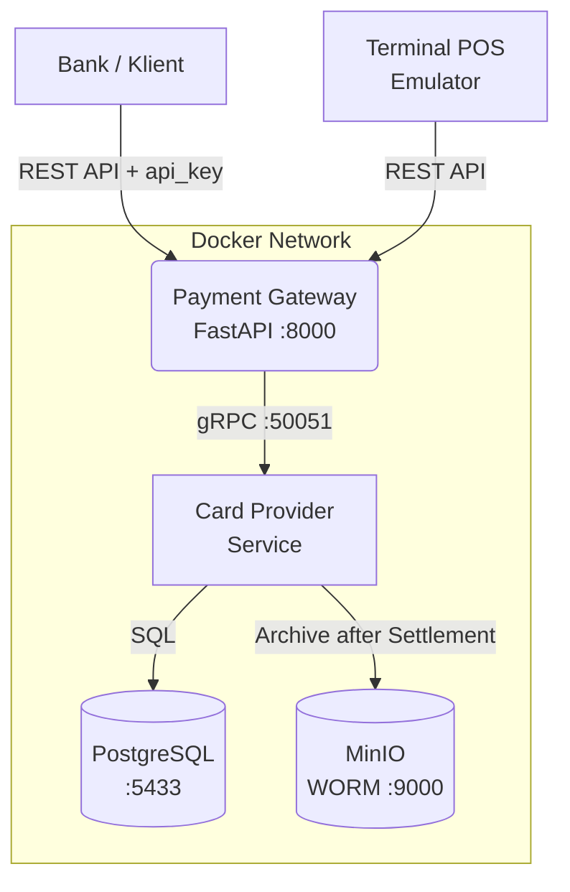
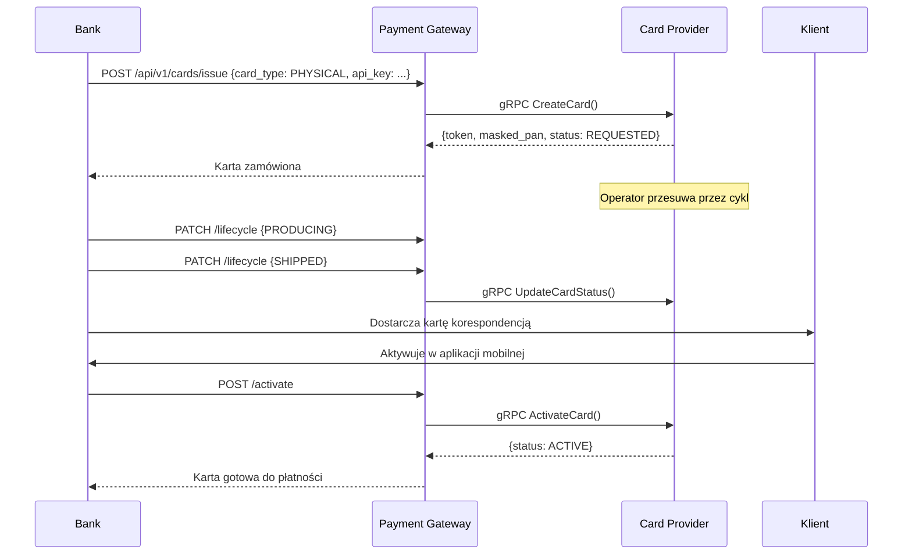
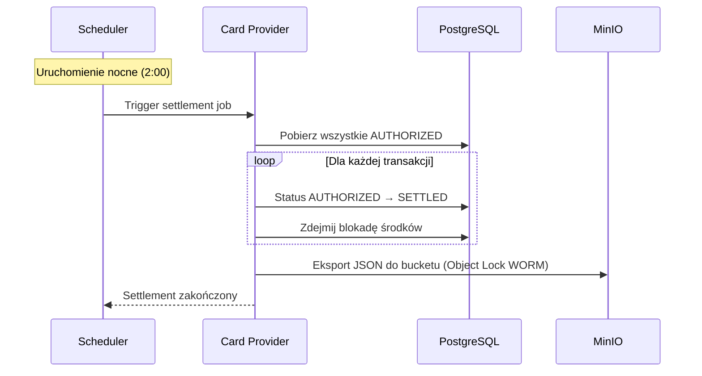
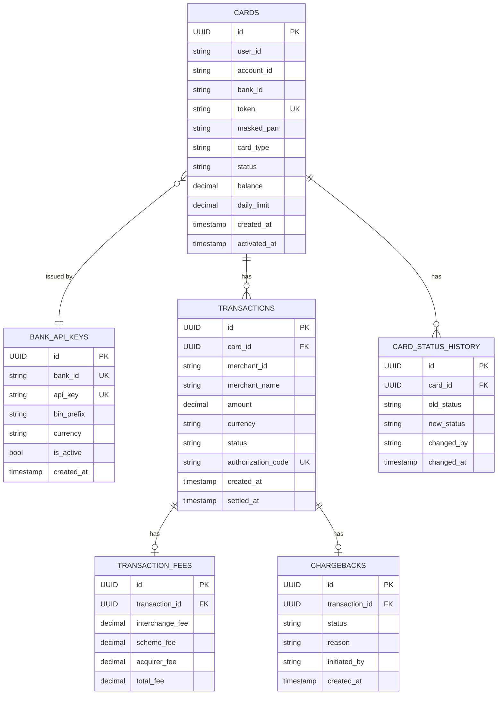

# 💳 Moduł: Karty Płatnicze (Payment Cards Domain)

> **Projekt Zaliczeniowy – Aplikacje Biznesowe**  
> Architektura Mikroserwisowa | Domain Driven Design | Python + gRPC + Docker

---

## 📋 Spis treści

1. [Opis modułu](#opis-modułu)
2. [Architektura systemu](#architektura-systemu)
3. [Wiedza Domenowa](#wiedza-domenowa)
4. [Cykl życia karty – Maszyna Stanów](#cykl-życia-karty--maszyna-stanów)
5. [Diagramy](#diagramy)
6. [Schemat bazy danych](#schemat-bazy-danych)
7. [Struktura repozytorium](#struktura-repozytorium)
8. [Technologie](#technologie)
9. [Uruchomienie projektu](#uruchomienie-projektu)
10. [Klucze API Banków – BIN Routing](#klucze-api-banków--bin-routing)
11. [API – Dokumentacja dla innych zespołów](#api--dokumentacja-dla-innych-zespołów)
12. [Integracja z modułem kart (dla zespołów bankowych)](#integracja-z-modułem-kart-dla-zespołów-bankowych)
13. [Plan rozwoju](#plan-rozwoju)

---

## Opis modułu

Moduł **Karty Płatnicze** składa się z **dwóch osobnych aplikacji**:

- **Card Provider Service** – wydawca kart (Issuer), zarządza cyklem życia kart, autoryzuje transakcje
- **Payment Gateway Service** – procesor płatności (Acquirer), obsługuje terminal POS, REST API dla banków

### Główne funkcjonalności

- Wydawanie kart wirtualnych, fizycznych i prepaid
- Maszyna stanów karty: `REQUESTED → PRODUCING → SHIPPED → ACTIVE → BLOCKED`
- Autoryzacja transakcji w czasie rzeczywistym (gRPC)
- Clearing i Settlement w cyklu dobowym
- MSC (Merchant Service Charge) z podziałem prowizji
- Archiwizacja transakcji w MinIO (WORM)
- Emulacja terminala płatniczego (POS)

---

## Architektura systemu


```mermaid
graph TD
    BANK[Bank / Klient] -->|REST API + api_key| GW(Payment Gateway\nFastAPI :8000)
    TERMINAL[Terminal POS\nEmulator] -->|REST API| GW
    GW -->|gRPC :50051| CP[Card Provider\nService]
    CP -->|SQL| DB[(PostgreSQL\n:5433)]
    CP -->|Archive after Settlement| MINIO[(MinIO\nWORM :9000)]

    subgraph Docker Network
        GW
        CP
        DB
        MINIO
    end
```

### Mikroserwisy

#### Card Provider Service (port 50051 – gRPC)
- Właściciel danych kart i transakcji
- Autoryzacja, blokada środków
- Maszyna stanów karty
- Clearing i Settlement

#### Payment Gateway Service (port 8000 – REST)
- Punkt styku ze światem zewnętrznym
- Weryfikacja kluczy API banków
- Routing do Card Provider przez gRPC
- Obliczanie prowizji MSC
- Swagger UI: `http://localhost:8000/docs`

---

## Wiedza Domenowa

### Model 4-stronny (Four-Party Scheme)

W rzeczywistości płatność kartą angażuje 4 strony:

```
Klient → [Merchant/Terminal] → [Acquirer/Processor] → [Issuer/Bank] → Klient
```

W naszym projekcie:
- **Acquirer** = Payment Gateway Service
- **Issuer** = Card Provider Service
- **Bank** = zewnętrzny moduł bankowy (inny zespół)
- **Terminal** = emulator POS lub płatność online

### Etapy płatności kartą

| Etap | Opis | Czas |
|---|---|---|
| **Authorization** | Sprawdzenie karty, blokada środków | Real-time (ms) |
| **Capture** | Potwierdzenie transakcji przez merchanta | Chwilę po auth |
| **Clearing** | Wymiana informacji rozliczeniowych | T+0 do T+1 |
| **Settlement** | Finalny transfer środków między bankami | T+1 |

### Komunikacja – ISO 8583 i gRPC

Fizyczne terminale POS używają protokołu **ISO 8583** – binarnego protokołu
telekomunikacyjnego z 128+ polami danych (Data Elements) i nagłówkiem MTI
(Message Type Indicator).

W projekcie implementujemy **uproszczony podzbiór ISO 8583** – wiadomości
zawierają rzeczywiste pola DE (MTI, DE2, DE3, DE4, DE7, DE11, DE41, DE49)
w czytelnym formacie, bez wymagań licencyjnych pełnej implementacji.

Komunikacja wewnętrzna między serwisami pozostaje w **gRPC + Protocol Buffers**.
Warstwa wejściowa (terminal → Payment Gateway) przyjmuje strukturę ISO 8583.

>  **Szczegółowy format wiadomości ISO 8583 jest w trakcie ustalania.**

### MSC (Merchant Service Charge)

Prowizja pobierana od każdej transakcji, dzielona na 3 składowe:

| Składowa | Odbiorca | Stawka |
|---|---|---|
| Interchange Fee | Bank wydawcy karty | ~1.5% |
| Scheme Fee | Card Provider (my) | ~0.3% |
| Acquirer Fee | Payment Gateway | ~0.2% |

---

## Cykl życia karty – Maszyna Stanów

### Diagram stanów

```mermaid
stateDiagram-v2
    [*] --> REQUESTED : Bank zamawia kartę
    POST /api/v1/cards/issue

    REQUESTED --> PRODUCING : Operator rozpoczyna produkcję
    PATCH /lifecycle {PRODUCING}
    REQUESTED --> ACTIVE : [VIRTUAL ONLY]
    Auto-aktywacja po max 1h

    PRODUCING --> SHIPPED : Karta wysłana do banku
    PATCH /lifecycle {SHIPPED}

    SHIPPED --> ACTIVE : Klient aktywuje kartę w aplikacji banku
    POST /activate

    ACTIVE --> BLOCKED : Zastrzeżenie karty
    PATCH /status {BLOCKED}
    BLOCKED --> ACTIVE : Odblokowanie karty
    PATCH /status {ACTIVE}

    ACTIVE --> [*] : Wygaśnięcie / Anulowanie
    BLOCKED --> [*] : Trwałe zastrzeżenie
```

### Logika per typ karty

| Typ | Status startowy | Aktywacja | Saldo |
|---|---|---|---|
| **VIRTUAL** | REQUESTED | Auto po max 1h | Brak (płatności przez konto bankowe) |
| **PHYSICAL** | REQUESTED | Ręczna przez klienta (po SHIPPED) | Brak |
| **PREPAID** | REQUESTED | Ręczna przez klienta (po SHIPPED) | Własne saldo, możliwość doładowania |

### Dozwolone przejścia stanów

```
REQUESTED  → PRODUCING          (tylko operator)
PRODUCING  → SHIPPED            (tylko operator)
SHIPPED    → ACTIVE             (klient aktywuje w aplikacji banku)
SHIPPED    → BLOCKED            (awaryjne zastrzeżenie przed aktywacją)
ACTIVE     → BLOCKED            (zastrzeżenie)
BLOCKED    → ACTIVE             (odblokowanie)
```

---

## Diagramy

### BPMN: Wydanie i aktywacja karty fizycznej


```mermaid
sequenceDiagram
    participant B as Bank
    participant GW as Payment Gateway
    participant CP as Card Provider
    participant K as Klient

    B->>GW: POST /api/v1/cards/issue   {card_type: PHYSICAL, api_key: ...}
    GW->>CP: gRPC CreateCard()
    CP-->>GW: {token, masked_pan, status: REQUESTED}
    GW-->>B: Karta zamówiona

    Note over CP: Operator przesuwa przez cykl
    B->>GW: PATCH /lifecycle {PRODUCING}
    B->>GW: PATCH /lifecycle {SHIPPED}
    GW->>CP: gRPC UpdateCardStatus()

    B->>K: Dostarcza kartę korespondencją
    K->>B: Aktywuje w aplikacji mobilnej
    B->>GW: POST /activate
    GW->>CP: gRPC ActivateCard()
    CP-->>GW: {status: ACTIVE}
    GW-->>B: Karta gotowa do płatności
```

### BPMN: Autoryzacja płatności

```mermaid
sequenceDiagram
    participant T as Terminal POS
    participant GW as Payment Gateway
    participant CP as Card Provider
    participant DB as PostgreSQL

    T->>GW: POST /api/v1/payments/authorize  {card_number, cvv, amount}
    Note over GW: Walidacja Luhna\nTokenizacja PAN
    GW->>CP: gRPC AuthorizeTransaction()  {card_token, amount, merchant}
    CP->>DB: Sprawdź status karty
    CP->>DB: Sprawdź saldo / limit
    alt Karta ACTIVE i wystarczające środki
        CP->>DB: Blokada środków  
        Zapis transakcji AUTHORIZED
        CP-->>GW: {APPROVED, auth_code}
        GW-->>T: 200 APPROVED
    else Karta nie ACTIVE lub brak środków
        CP-->>GW: {DECLINED, reason}
        GW-->>T: 200 DECLINED
    end
```

### BPMN: Clearing & Settlement (nocny)


```mermaid
sequenceDiagram
    participant S as Scheduler
    participant CP as Card Provider
    participant DB as PostgreSQL
    participant MINIO as MinIO

    Note over S: Uruchomienie nocne (2:00)
    S->>CP: Trigger settlement job
    CP->>DB: Pobierz wszystkie AUTHORIZED
    loop Dla każdej transakcji
        CP->>DB: Status AUTHORIZED → SETTLED
        CP->>DB: Zdejmij blokadę środków
    end
    CP->>MINIO: Eksport JSON do bucketu  (Object Lock WORM)
    CP-->>S: Settlement zakończony
```

---

## Schemat bazy danych


```mermaid
erDiagram
    CARDS {
        UUID id PK
        string user_id
        string account_id
        string bank_id
        string token UK
        string masked_pan
        string card_type
        string status
        decimal balance
        decimal daily_limit
        timestamp created_at
        timestamp activated_at
    }

    BANK_API_KEYS {
        UUID id PK
        string bank_id UK
        string api_key UK
        string bin_prefix
        string currency
        bool is_active
        timestamp created_at
    }

    TRANSACTIONS {
        UUID id PK
        UUID card_id FK
        string merchant_id
        string merchant_name
        decimal amount
        string currency
        string status
        string authorization_code UK
        timestamp created_at
        timestamp settled_at
    }

    TRANSACTION_FEES {
        UUID id PK
        UUID transaction_id FK
        decimal interchange_fee
        decimal scheme_fee
        decimal acquirer_fee
        decimal total_fee
    }

    CARD_STATUS_HISTORY {
        UUID id PK
        UUID card_id FK
        string old_status
        string new_status
        string changed_by
        timestamp changed_at
    }

    CHARGEBACKS {
        UUID id PK
        UUID transaction_id FK
        string status
        string reason
        string initiated_by
        timestamp created_at
    }

    CARDS ||--o{ TRANSACTIONS : "has"
    CARDS ||--o{ CARD_STATUS_HISTORY : "has"
    CARDS }o--|| BANK_API_KEYS : "issued by"
    TRANSACTIONS ||--o| TRANSACTION_FEES : "has"
    TRANSACTIONS ||--o| CHARGEBACKS : "has"
```

---

## Struktura repozytorium

```
.
├── docker-compose.yaml
├── proto/
│   └── card.proto                    # Kontrakt gRPC
├── card-provider-service/
│   ├── Dockerfile
│   ├── requirements.txt
│   ├── alembic/                      # Migracje bazy danych
│   └── app/
│       ├── main.py                   # Serwer gRPC
│       ├── models.py                 # SQLAlchemy modele
│       ├── database.py               # Połączenie DB + seed kluczy API
│       ├── card_pb2.py               # Wygenerowane z proto
│       └── card_pb2_grpc.py
├── payment-gateway-service/
│   ├── Dockerfile
│   ├── requirements.txt
│   └── app/
│       ├── main.py                   # FastAPI REST API
│       ├── card_pb2.py
│       └── card_pb2_grpc.py
└── README.md
```

---

## Technologie

| Warstwa | Technologia | Uzasadnienie |
|---|---|---|
| Backend | Python 3.11 | Szybki development, bogate biblioteki |
| Komunikacja wewnętrzna | gRPC + Protocol Buffers | Binarny, typowany kontrakt – analogia do ISO 8583 |
| REST API | FastAPI | Automatyczny Swagger, async, Pydantic |
| Baza danych | PostgreSQL 16 | ACID – krytyczne przy transakcjach finansowych |
| Archiwizacja | MinIO | S3-compatible, Object Lock (WORM) |
| Konteneryzacja | Docker Compose | Izolacja, łatwe uruchomienie |

---

## Uruchomienie projektu

### Wymagania

- Docker Desktop lub Podman

### Start

```bash
docker-compose up --build
```

### Serwisy po uruchomieniu

| Serwis | Adres | Opis |
|---|---|---|
| REST API + Swagger | http://localhost:8000/docs | Główny interfejs |
| Payment Gateway | http://localhost:8000 | REST API |
| Card Provider | localhost:50051 | gRPC (wewnętrzny) |
| PostgreSQL | localhost:5433 | Baza danych |
| MinIO Console | http://localhost:9001 | Archiwum (planowane) |

### Zmienne środowiskowe

| Zmienna | Domyślna | Opis |
|---|---|---|
| `DATABASE_URL` | `postgresql+asyncpg://...` | Połączenie z PostgreSQL |
| `GRPC_SERVER_URL` | `card-provider:50051` | Adres Card Provider |
| `VIRTUAL_CARD_ACTIVATION_DELAY` | `3600` | Czas auto-aktywacji karty wirtualnej w sekundach |

> **DEV TIP:** Czas jest ustawiony: `VIRTUAL_CARD_ACTIVATION_DELAY=60` w docker-compose.yaml żeby testować auto-aktywację po 60 sekundach zamiast 1 godziny.

---

## Klucze API Banków – BIN Routing

Każdy bank otrzymuje unikalny klucz API przy podpisaniu umowy z procesorem kart. Na podstawie klucza przypisywany jest prefiks BIN (pierwsze 4 cyfry numeru karty), który identyfikuje bank-wydawcę podczas autoryzacji.

| bank_id | Klucz API | Prefiks BIN | Waluta |
|---|---|---|---|
| `POLISH_BANK_A` | `bank-key-pl-a` | `4100` | PLN |
| `POLISH_BANK_B` | `bank-key-pl-b` | `4200` | PLN |
| `EURO_BANK_A` | `bank-key-eu-a` | `4300` | EUR |
| `EURO_BANK_B` | `bank-key-eu-b` | `4400` | EUR |
| `UK_BANK_A` | `bank-key-uk-a` | `4500` | GBP |
| `UK_BANK_B` | `bank-key-uk-b` | `4600` | GBP |
| `US_BANK_A` | `bank-key-us-a` | `4700` | USD |
| `US_BANK_B` | `bank-key-us-b` | `4800` | USD |

Klucz API przekazywany jest w polu `api_key` w body żądania wydania karty.

---

## API – Dokumentacja dla innych zespołów

> Pełna dokumentacja interaktywna: **http://localhost:8000/docs**

### Endpointy REST (Payment Gateway :8000)

#### Karty

| Metoda | Endpoint | Opis |
|---|---|---|
| `POST` | `/api/v1/cards/issue` | Wydaj nową kartę |
| `GET` | `/api/v1/cards` | Lista wszystkich kart |
| `GET` | `/api/v1/cards/{token}` | Szczegóły karty |
| `PATCH` | `/api/v1/cards/{token}/status` | Zablokuj / Odblokuj |
| `PATCH` | `/api/v1/cards/{token}/lifecycle` | Przesuń przez cykl produkcji |
| `POST` | `/api/v1/cards/{token}/activate` | Aktywuj kartę |
| `POST` | `/api/v1/cards/{token}/topup` | Doładuj kartę prepaid |

#### Płatności

| Metoda | Endpoint | Opis |
|---|---|---|
| `POST` | `/api/v1/payments/authorize` | Autoryzuj płatność |
| `POST` | `/api/v1/payments/{id}/capture` | Potwierdź transakcję |
| `POST` | `/api/v1/payments/{id}/refund` | Zwrot środków |

### gRPC (Card Provider – port 50051)

Plik kontraktu: `proto/card.proto`

```protobuf
service CardProvider {
    rpc CreateCard (CreateCardRequest) returns (CreateCardResponse);
    rpc GetCardStatus (GetCardRequest) returns (CardDetails);
    rpc ListCards (ListCardsRequest) returns (ListCardsResponse);
    rpc BlockCard (BlockCardRequest) returns (BlockCardResponse);
    rpc UnblockCard (UnblockCardRequest) returns (UnblockCardResponse);
    rpc UpdateCardStatus (UpdateCardStatusRequest) returns (UpdateCardStatusResponse);
    rpc ActivateCard (ActivateCardRequest) returns (ActivateCardResponse);
    rpc TopUpPrepaid (TopUpRequest) returns (TopUpResponse);
    rpc AuthorizeTransaction (AuthorizationRequest) returns (AuthorizationResponse);
    rpc SettleTransaction (SettlementRequest) returns (SettlementResponse);
    rpc InitiateChargeback (ChargebackRequest) returns (ChargebackResponse);
}
```

---

## Integracja z modułem kart (dla zespołów bankowych)

> **Ta sekcja jest przeznaczona dla zespołów tworzących moduły bankowe.**  
> Lokalnie: `http://localhost:8000`

### 1. Jak zamówić kartę dla klienta

```bash
curl -X POST http://localhost:8000/api/v1/cards/issue \
  -H "Content-Type: application/json" \
  -d '{
    "user_id": "twoj_user_id",
    "account_id": "twoje_account_id",
    "card_type": "VIRTUAL",
    "initial_balance": 0,
    "api_key": "bank-key-pl-a"
  }'
```

**Odpowiedź:**
```json
{
  "card_token": "tok_abc123...",
  "masked_pan": "4100 **** **** 7890",
  "status": "REQUESTED",
  "card_type": "VIRTUAL",
  "bank_id": "POLISH_BANK_A"
}
```

> Zachowaj `card_token` – to jedyny identyfikator karty w naszym systemie.

**Typy kart:**
- `VIRTUAL` – aktywuje się automatycznie po max 1h, bez fizycznego nośnika
- `PHYSICAL` – wymaga przejścia przez cykl produkcji i aktywacji przez klienta
- `PREPAID` – jak PHYSICAL, ale z własnym saldem (podaj `initial_balance`)

### 2. Jak aktywować kartę (po dostarczeniu klientowi)

Dotyczy kart PHYSICAL i PREPAID – karta musi być w statusie `SHIPPED`:

```bash
curl -X POST http://localhost:8000/api/v1/cards/{card_token}/activate \
  -H "Content-Type: application/json" \
  -d '{"activated_by": "customer_id"}'
```

### 3. Jak zablokować/odblokować kartę

```bash
# Zablokuj
curl -X PATCH http://localhost:8000/api/v1/cards/{card_token}/status \
  -H "Content-Type: application/json" \
  -d '{"status": "BLOCKED", "reason": "Lost card"}'

# Odblokuj
curl -X PATCH http://localhost:8000/api/v1/cards/{card_token}/status \
  -H "Content-Type: application/json" \
  -d '{"status": "ACTIVE"}'
```

### 4. Jak sprawdzić status karty

```bash
curl http://localhost:8000/api/v1/cards/{card_token}
```

### 5. Co bank musi zaimplementować po swojej stronie

Aby autoryzacja i rozliczenia działały, każdy bank musi udostępnić te endpointy:

#### `POST /api/v1/authorize`
Weryfikacja salda i blokada środków na koncie klienta.

**Request (od nas do banku):**
```json
{
  "account_id": "uuid",
  "amount": 150.00,
  "currency": "PLN",
  "transaction_id": "uuid",
  "merchant_name": "Sklep XYZ"
}
```

**Response (oczekujemy):**
```json
{
  "authorization_code": "AUTH-789XYZ",
  "status": "APPROVED",
  "decline_reason": null
}
```

Możliwe wartości `decline_reason`: `INSUFFICIENT_FUNDS`, `ACCOUNT_BLOCKED`, `LIMIT_EXCEEDED`

#### `POST /api/v1/capture`
Finalizacja transakcji – zdjęcie blokady, faktyczne obciążenie konta.

**Request:**
```json
{
  "authorization_code": "AUTH-789XYZ",
  "transaction_id": "uuid"
}
```

**Response:**
```json
{
  "status": "SETTLED"
}
```

#### `POST /api/v1/refund`
Zwrot środków na konto klienta.

**Request:**
```json
{
  "account_id": "uuid",
  "amount": 150.00,
  "currency": "PLN",
  "original_transaction_id": "uuid"
}
```

**Response:**
```json
{
  "status": "REFUNDED"
}
```

### 6. Kody odpowiedzi autoryzacji

| Kod | Znaczenie |
|---|---|
| `APPROVED` | Transakcja zatwierdzona |
| `DECLINED` | Odmowa ogólna |
| `CARD_BLOCKED` | Karta zastrzeżona |
| `CARD_NOT_ACTIVE` | Karta nie przeszła aktywacji |
| `INSUFFICIENT_FUNDS` | Brak środków |
| `LIMIT_EXCEEDED` | Przekroczony limit dzienny |
| `INVALID_CVV` | Nieprawidłowy kod CVV |
| `BANK_TIMEOUT` | Bank nie odpowiedział w czasie |

---

## Plan rozwoju

### Etap 1 – Ocena 3.0

| Zadanie | Status |
|---|---|
| Baza danych + modele SQLAlchemy | ✅ Zrobione |
| gRPC CreateCard + typy kart | ✅ Zrobione |
| Maszyna stanów karty | ✅ Zrobione |
| Auto-aktywacja karty wirtualnej (1h) | ✅ Zrobione |
| REST API dla kart (issue, get, block) | ✅ Zrobione |
| BIN routing + API Keys banków | ✅ Zrobione |
| Doładowanie karty prepaid | ✅ Zrobione |
| AuthorizeTransaction (gRPC) | 🔄 W trakcie |
| REST API Terminal POS | 🔄 W trakcie |
| MSC – Merchant Service Charge | 🔄 W trakcie |
| Clearing & Settlement (nocny job) | 🔄 W trakcie |
| Panel operatora (UI) | 🔄 W trakcie |
| Panel terminala (POS UI) | 🔄 W trakcie |

### Etap 2 – Ocena 4.0

| Zadanie | Status |
|---|---|
| Płatności offline (floor limit) | ⏳ Planowane |
| Archiwizacja MinIO (WORM) | ⏳ Planowane |

### Etap 3 – Ocena 5.0

| Zadanie | Status |
|---|---|
| Mechanizm Chargeback | ⏳ Planowane |
| Symulacja sieci VPN / izolacja Docker | ⏳ Planowane |
